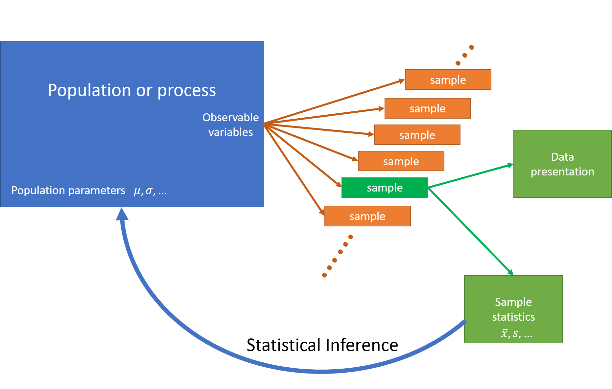

# Sampling

```{r echo=FALSE}
set.seed(123)
```

In statistics the data we analyse is often a subset, i.e. 
a **sample** of members of a **population**.

> For example we might have a sample of households whose members respond to a questionnaire,
> or a sample of plants from a field. 

In order to select from a population we first enumerate (list) the population in some
way and then make a random selection of our subset members from that list.  The method
by which we do so is called the **sample design**.  

Our focus in statistics is often the **estimation** of population characteristics
(known as **population parameters**) on the basis of sample characteristics
(which are called **sample statistics**).  We are always aware that the sample 
we drew from the population is not the only sample we could have drawn, and therefore
our conclusions are subject to uncertainty, which we call **sampling error**.  

This uncertainty associated with sampling is the reason we have confidence intervals
on our estimates, and why we can neither **prove** nor **disprove** hypotheses.  

```{r statistical-infrence, fig.cap="Statistical Inference", out.width='100%', echo=FALSE, fig.align="center"}

```

(One exception is when we do a **census** where we select and get fully accurate data
from every member of the population.  Then there's no uncertainty left at all, 
and our sampling errors are zero.)

When generating **simulated** datasets we also generate samples.  Simulation
is often done as a means of testing out statistical ideas and methods, 
or (in the case of the bootstrap method) when conventional ways of estimating
standard errors (and therefore confidence intervals) don't work. 

Before we get into detail of estimation and inference, let's spend some time
thinking about how sampling works.  

## Random numbers

In both settings (sampling and simulation) we need to start with a method
of generating random numbers.  We'll start by assuming we have 
some means of generating a random sequence of numbers uniformly 
distributed in the interval [0,1]:
\[
    U_i \sim \text{Uniform}(0,1)\qquad \text{for $i=1,2,3, \ldots$}
\]
Here 'uniformly distributed' means that all values in the range [0,1] are
equally likely to occur.  

In R this is done using the `runif()` function.  For example to generate 5 
random draws from Uniform(0,1):
```{r}
runif(5)
```

Another draw will a different set of random numbers:
```{r}
runif(5)
```

If we draw a histogram of 100 draws it looks a bit lumpy:
```{r} 
#| fig.align='center',
#| fig.width=5,
#| fig.cap="100 draws from Uniform(0,1)"
hist(runif(100), xlab="x", ylab="Frequency")
```

But a histogram of 100,000 draws is very uniform:
```{r} 
#| fig.align='center',
#| fig.width=5,
#| fig.cap="100000 draws from Uniform(0,1)"
hist(runif(100000), xlab="x", ylab="Frequency")
```

Although the numbers appear to be random they are in fact generated using
formulae, so if one knows the formula the sequence of random numbers generated by
`runif()` is completed predictable.  However the formula
is complex enough that there are no easily discernible patterns in sequences of 
many millions of draws.  These numbers are **psuedo-random**, but they are
random enough for our purposes.  

Underlying the random number generator is a **seed** value, which initiates the
sequence.  If we set the seed to a particular value, the sequence of random
numbers that will be generated after doing so will always be the same.

```{r}
set.seed(111)
runif(5)
runif(5)
runif(5)
```

```{r}
set.seed(8)
runif(5)
```

```{r}
set.seed(111)
runif(5)
```

This property can be very useful when testing and comparing algorithms: 
we can generate an identical sequence of random numbers and check (for
example) that two methods of estimation give the same results on 
two identical randomly generated datasets.  

## Sampling from categorical random variables

Draws from a uniform distribution are all we need to simulate/sample
from any distribution.  

**Heads or tails**: if the probability of flipping heads is 0.5, 
we can generate `n` random numbers, and then label any values less 
than 0.5 as Heads and the remainder as tails.

```{r echo=FALSE}
set.seed(123)
```


```{r}
n <- 10
u <- runif(n)
u
y <- ifelse(u<=0.5,"Heads","Tails")
y
table(y)
```

```{r}
table(ifelse(runif(10000)<=0.5,"Heads","Tails"))
```

We can extend this idea to any set of categories.

**Red, Green or Blue**: Say we have a six sided die: three sides are red, two are green and one is blue.
The probabilities of rolling the three colours are therefore $\frac12$, $\frac13$, $\frac16$ respectively.  
These probabilities add to one.

The random variable $Y$ is the colour that the die shows when we roll it.

```{r}
pp <- c(Red=1/2, Green=1/3, Blue=1/6)
sum(pp)
```
In general we might have $m$ categories, where the probability of that $Y$ 
category $k$ is $p_k$: $\Pr(Y=k)=p_k$. and 
\[
   \sum_{k=1}^m p_k = 1
\]
We then compute the **cumulative probabilities** $c_k$, the partial sums of these probabilities:
\[
   c_k = \sum_{j=1}^k p_j
\]
The final cumulative probability $c_m$ is always 1 by definition.  

Implicitly we also have a value $c_0=0$, which is the the empty sum and always 
equal to zero. 

These cumulative probabilities $c_k$ are 'the probability that random variable $Y$ has
a category label less than or equal to $k$:
\[
    \Pr(Y\leq k) = c_k = \sum_{j=1}^k p_j
\]

**Red, Green or Blue**: the cumulative probabilities are
\begin{eqnarray*}
  c_0 &=& 0.0000\\
  c_1 &=& p_1 = 0.5000\\
  c_2 &=& p_1+p_2 = 0.5000 + 0.3333 = 0.8333\\
  c_3 &=& p_1+p_2+p_3 = 0.5000 + 0.3333 + 0.1667 = 1.0000
\end{eqnarray*}

```{r}
m <- length(pp) # Number of categories
cp <- cumsum(pp)
cp
```

We then take a set of uniform random numbers $u_1,\ldots,u_n$.  We then
want to find which of the $m$ labels corresponds to each random number $u_i$. 

The rule is that if $u_i$ is less than cumulative probability $c_k$ but 
greater than $c_{k-1}$, then we assign the label $k$.  

There are various ways to do this, here's a version using `case_when()` from 
the `dplyr` package:
```{r}
set.seed(112)
u <- runif(8)
u
y <- case_when(u <= cp[1] ~ "Red",
               u <= cp[2] ~ "Green",
               .default="Blue")   # here .default means "otherwise"
data.frame(round(u,5),y)
table(y)
table(y)/length(y)
```

Note that the categories in the table haven't come out in the Red-Green-Blue order that we want -
instead they're in the default alphabetical order.

We can fix this by converting `y` to a `factor` object:

```{r}
y <- factor(y,levels=names(pp))
table(y)
```

Here's what is really going on: we if we plot the cumulative probabilities as
a staircase -- a **cumulative distribution function (CDF)** then 
we draw $u_i$ from a Uniform(0,1) distribution, and then find where
a horizontal line drawn at the level of $u_i$ intersects the CDF: and that
is the value of the categorical variable $y_i$.  

The larger the probability $p_k$ the bigger the jump in the staircase, and
the larger the probability that category $k$ will be selected.  

```{r echo=FALSE}
#| fig.align='center',
#| fig.width=5,
#| fig.cap="Drawing a random category"
i <- 1
plot(0:m,c(0,cp),type="s",ylim=c(0,1),axes=FALSE,
     xlab="Category",ylab="U")
axis(1,at=1:m,labels=names(pp)); axis(2); box()
axis(4,at=c(0,cp),lab=sprintf("%.3f",c(0,cp)),las=2)
text(0,u[i],label=bquote(u[.(i)]),pos=2,xpd=TRUE)
points(0,u[i],pch=16,cex=1.7,col="red")
arrows(0,u[i], as.numeric(y[i]),u[i], col="red", lwd=2)
arrows(as.numeric(y[i]),u[i], as.numeric(y[i]),0, col="red", lwd=2)
title(bquote(u[.(i)]==.(sprintf("%.3f",u[i]))*"; "*y[.(i)]*"="*.(as.character(y[i]))))
```


```{r echo=FALSE}
#| fig.align='center',
#| fig.width=5,
#| fig.cap="Drawing a random category"
i <- 2
plot(0:m,c(0,cp),type="s",ylim=c(0,1),axes=FALSE,
     xlab="Category",ylab="U")
axis(1,at=1:m,labels=names(pp)); axis(2); box()
axis(4,at=c(0,cp),lab=sprintf("%.3f",c(0,cp)),las=2)
text(0,u[i],label=bquote(u[.(i)]),pos=2,xpd=TRUE)
points(0,u[i],pch=16,cex=1.7,col="red")
arrows(0,u[i], as.numeric(y[i]),u[i], col="red", lwd=2)
arrows(as.numeric(y[i]),u[i], as.numeric(y[i]),0, col="red", lwd=2)
title(bquote(u[.(i)]==.(sprintf("%.3f",u[i]))*"; "*y[.(i)]*"="*.(as.character(y[i]))))
```


```{r}
set.seed(112)
n <- 10000
u <- runif(n)
y <- case_when(u <= cp[1] ~ "Red",
               u <= cp[2] ~ "Green",
               .default="Blue")
y <- factor(y, levels=names(pp))
table(y)
```

The `sample()` function implements this conveniently: select from the integers
1 to `m`
```{r}
n <- 10000
y <- sample(m, size=n, prob=pp, replace=TRUE)
table(y)
```
(need `replace=TRUE` here, see below).

... or state the vector `1:m` explicitly
```{r}
y <- sample(1:m, size=n, prob=pp, replace=TRUE)
table(y)
```

... or directly from the vector of labels ...
```{r}
y <- sample(c("Red","Green","Blue"), size=n, prob=pp, replace=TRUE)
y <- factor(y,levels=names(pp))
table(y)
```

... get the labels from `pp` ...
```{r}
y <- sample(names(pp), size=n, prob=pp, replace=TRUE)
y <- factor(y,levels=names(pp))
table(y)
```


## Sampling from discrete numerical random variables

The ideas above carry straight over to discrete numerical random variables.

The Binomial distribution $Y\sim\text{Bin}(m,p)$ is the number
of successes in $m$ trials where the probability of success on each
trial is the same $p$, and all the trials are independent.  

$Y$ takes values 0 to $m$, and those probabilities can be calculated by
\[
   P(Y=k) = \binom{m}{k} p^k (1-p)^{m-k} = \frac{m!}{k!(m-k)!} p^k (1-p)^{m-k}
\]
R provides these probabilities in the function `dbinom()`

e.g. $m=10$ rolls of a six-sided die, and $Y$ is the number of times we get a 1, 
so $p=1/6$
```{r}
m <- 10
p <- 1/6
pp <- dbinom(0:m, m, p)
pp
```


```{r}
#| fig.align='center',
#| fig.width=5,
#| fig.cap="Binomial probabilities"
barplot(pp, names=0:m,
        xlab="y", ylab="Pr(Y=y)",
        main=bquote("Bin("*.(m)*","*.(sprintf(" %.4f",p))*")"))
```

The CDF is given by the function `pbinom()`
```{r}
cp <- pbinom(0:m, m, p)
```


```{r}
#| fig.align='center',
#| fig.width=5,
#| fig.cap="Binomial CDF"
plot(0:m, cp, type="s",
        xlab="y", ylab="Pr(Y<=y)",
        main=bquote("Bin("*.(m)*","*.(sprintf(" %.4f",p))*")"))
```

Drawing a single value of $Y$ proceeds the same way as for a categorical
variable:

```{r echo=FALSE}
#| fig.align='center',
#| fig.width=5,
#| fig.cap="Drawing from a Binomial(10,1/6) distribution"
u <- 0.511
cp <- pbinom(0:m, m, p)
y <- min((0:m)[u<cp])
plot(c(0,0:m),c(0,cp),type="s",ylim=c(0,1),
     xlab="Y",ylab="U")
text(0,u,label=expression(u),pos=2,xpd=TRUE)
points(0,u,pch=16,cex=1.7,col="red")
arrows(0,u, y,u, col="red", lwd=2)
arrows(y,u, y,0, col="red", lwd=2)
title(bquote(u==.(sprintf("%.3f",u))*"; "*y*"="*.(y)))
```

So we can draw multiple values of $Y$ from Bin(10,$\frac16$) 
using the `sample()` function:

```{r}
#| fig.align='center',
#| fig.width=5,
#| fig.cap="10000 draws from a Binomial(10,1/6)"
n <- 10000
pp <- dbinom(0:m, m, p)
y <- sample(0:m, n, prob=pp, replace=TRUE)
barplot(table(y))
```

Of course R provides a specific function for doing the same thing: `rbinom()`
```{r}
#| fig.align='center',
#| fig.width=5,
#| fig.cap="10000 draws from a Binomial(10,1/6)"
n <- 10000
y <- rbinom(n, m, p)
barplot(table(y))
```
But that function is just doing what we've described above using `sample()`.

A particular common example is where we have $m$ objects and want to select 
one of them at random, with each object having equal probability of being 
selected: i.e. each has probability $1/m$.  

## Sampling from continuous random variables

Continous random variables are simulated using the same principle.  

The cumulative distribution function (CDF) of a continuous random variable $Y$ is
defined to be
\[
   F(y) = \Pr(Y\leq y) = \int_{-\infty}^y f(y')\;{\rm d}y'
\]
```{r echo=FALSE}
#| fig.align='center',
#| fig.width=8,
#| fig.cap="Normal distribution density and CDF"
par(mfrow=c(1,2))
np <- 101
x <- seq(from=-3, to=+3, length=np)
y <- dnorm(x)
plot(x,y, type="l",main="Normal density",xlab="y",ylab="f(y)")
z <- 1
x <- seq(from=-3, to=z, length=np)
y <- dnorm(x)
polygon(c(x[1],x,x[np]),c(0,y,0),col="grey")
x <- seq(from=-3, to=+3, length=np)
y <- pnorm(x)
plot(x,y, type="l",xlab="y",ylab="F(y)")
title(bquote("F(1)=Pr(Y<"*.(z)*")="*.(round(pnorm(z),4))))
x <- c(x[1],z,z); y <- c(rep(pnorm(z),2),0)
lines(x,y,col="red")
```

We can use $F(y)$ to draw a random value from the distribution of $Y$
by first drawing a random value $U$ from a Uniform(0,1) distribution. 

We then solve the equation
\[
   U = F(y)
\]
for  $y$: i.e. find the value of $y$ corresponding to a CDF value of $U$.

For many standard distributions (including the Normal and Gamma distributions) 
there is no analytic formula which gives the solution for $y$ given $u$: 
but there are numerical approximations which can be used in those settings.

One simple case which does have an analytic solution is the Exponential 
distribution $Y\sim\text{Exp}(\lambda)$.  This is a one parameter distribution 
where $Y$ is non-negative ($Y\geq 0$), and can be used to model cases such 
the length of time it takes for an event to occur (e.g. the length of time for a 
radioactive nucleus to decay).  The single parameter $\lambda$ is the **rate** 
(e.g. number of radioactive decay events per unit time).  

The exponential distribution has probability density function
\[
   f(y) = \lambda e^{-\lambda y}\qquad \text{where $y\geq 0$}
\]
and has mean $E[Y]=1/\lambda$. 

```{r echo=FALSE}
#| fig.align='center',
#| fig.width=5,
#| fig.cap="Exponential probability distribution"
lambda <- 0.5
np <- 101
yvec <- seq(from=0, to=10, length=np)
fvec <- lambda*exp(-lambda*yvec)
plot(yvec, fvec, type="l", 
     xlab="y", ylab="f(y)", main="Probability density of Exp(0.1)")
```

The CDF is the integral of the probability density function
\[
   \Pr(Y\leq y) = F(y) = \int_0^y f(y)\,{\rm d}y
\]
which for the Exponential distribution is
\[
  F(y) = \int_0^y \lambda e^{-\lambda t} {\rm d}t = 1 - e^{-\lambda y}
\]

```{r echo=FALSE}
#| fig.align='center',
#| fig.width=5,
#| fig.cap="Exponential cumulative probability distribution"
lambda <- 0.5
np <- 101
yvec <- seq(from=0, to=10, length=np)
cdfvec <- 1-exp(-lambda*yvec)
plot(yvec, cdfvec, type="l", 
     xlab="y", ylab="f(y)", main="CDF of Exp(0.1)")
```

Solving
\[
   u = F(y) = 1-e^{-\lambda y}
\]
for $y$ leads to 
\[
   y = -\frac{1}{\lambda}\log(1-u)
\]

Using this function we can easily draw directly from an 
Exponential distribution.  
```{r}
#| fig.align='center',
#| fig.width=5,
#| fig.cap="10000 draws from an Exponential distribution"
n <- 10000
u <- runif(n)
lambda <- 0.5
y <- -(1/lambda)*log(1-u)
mean(y)
hist(y, main="Histogram of draws from Exp(0.5)")
```


## Sampling from a finite collection

The simulations discussed so far all draw from **infinite** populations: 
we can set the sample size $n$ to any value.  However it often occurs that
we have only a finite population - e.g. when drawing a random sample 
of students from a class, or households from a suburb for interview. 
Then the population size $N$ is finite.

In the general case we have a set of $N$ **units** (i.e. students or households)
in a population of finite size, and we want to draw a sample of $n$ of these units.   

We usually start by listing or **enumerating** the units.  This list is called 
a **frame** or a **sample frame**.  

Consider the case where we have a small street containing 
$N=10$ houses, numbered 1-10. 
We want to select 5 of these houses with equal probability.  There are a number of 
ways we could do this.

### Sampling without replacement

If the houses have equal probability then we could proceed as follows:

 * We draw a random number from 1-10, e.g. house number 2, and mark it as selected
 * We draw another random number from 1-10, e.g. house number 5, and mark it as selected
 * We repeat this process, but if we choose a house that is already selected, we discard that
   selection;
 * The process continues until we have a set of 5 distinct houses.
 
At the start we take our frame (i.e. list) of houses, 
and initially mark them all as unselected.  Then at each step where we 
successfully select a previously unselected house we mark that house as selected.
 
```{r}
bigN <- 10 # population size
frame <- data.frame(house=1:bigN, selected=FALSE)
n <- 5  # sample size
nselected <- 0
while(nselected < n) {
  i <- sample(bigN, 1)  # sample a single number at random from 1:bigN with equal probability
  if(!frame$selected[i]) {
    frame$selected[i] <- TRUE
    nselected <- nselected + 1 
  }
}
frame$house[frame$selected]
```

It's not guaranteed how many steps this process is going to take, since the number
of times we select a house that has already been selected is random.  If the sample size
$n$ is small and the population size $N$ is large then it will take $n$ steps, or possibly 
just a few more.   If $n$ is close to $N$ and $N$ is large, it could take a very very
long time.

A simpler way to solve this is to assign each house a distinct random number
between 0 and 1, and then sort the frame in order of the random numbers.  

```{r}
bigN <- 10 # population size
frame <- data.frame(house=1:bigN, selected=FALSE)
n <- 5  # sample size
frame$u <- runif(bigN)
frame <- frame[order(frame$u),]
frame$selected[1:n] <- TRUE
frame
frame <- frame[order(frame$house),]
frame$house[frame$selected]
```

Of course, the simplest way of all is just to use the `sample()` function

```{r}
bigN <- 10 # population size
n <- 5  # sample size
sample(bigN, n)
```

It's very often that we do have a frame, a list of objects with names, and we 
want to select from this at random.

```{r}
frame <- data.frame(Name=c("Mark","Chloe","Sam","Caitlin","Harry","Nina"),
                    Age=c(20,19,18,19,19,21),
                    Major=c("STAT","STAT","DATA","COMP","MATH","STAT"))
frame
```

We can select, say, 3 names 

```{r}
n <- 3
samplenames <- sample(frame$Name, n)
samplenames
```

and then subset the frame
```{r}
samplemembers <- frame[frame$Name%in%samplenames,]
samplemembers
```

If you like dplyr
```{r}
samplemembers <- frame %>% 
  filter(Name%in%samplenames)
samplemembers
```

Note we can find out where in the frame particular individuals are located
```{r}
match(c('Mark','Harry'),frame$Name)
```

If we're sampling without replacement, note (of course) that the sample
size can be no bigger than the population size $n\leq N$.  

### Sampling with replacement

When selecting a sample of 5 houses it makes sense not to allow the possibility
of selecting the same house twice.  So when we've selected a house we remove
it from the list of houses available to select.  When using `sample()` this means 
that we set `replace=FALSE`, meaning after we've selected a member of the population
we don't put it back again.  

But there are occasions where we select **with replacement** is the sensible
thing to do.  This means there is a chance where a unit can be selected more than
once, and this occurs in situations where we want to assign different probabilities
of selection to different units of the population.

Starting with the the case of equal probabilities, we repeatedly draw
units from the population under identical circumstances: on every draw
each unit is available for selection, and we count how many times each
unit is selected.

```{r}
set.seed(111)
bigN <- 10
n <- 5
replicate(n, sample(bigN, 1))
```
In this sample we've drawn Unit 3 twice.

If $n$ is small and $bigN$ is large the probability of repeats is small.  But if a repeat
happens we of course do not make our selected household repeat the questionnaire, instead
we count them twice (or as many times as they are selected) in our analysis.  

Imagine our sample of 10 houses aren't actually just houses, they're farms, and some of them 
are very large and some are very small.  We want to give the large farms a high chance of
selection.  

```{r}
set.seed(122)
bigN <- 10
n <- 5
frame <- data.frame(farm=1:10, ncows=c(1000,5000,2000,500,500,
                                       5000,500,5000,30000,100))
frame
sample(frame$farm, n, prob=frame$ncows, replace=TRUE)
```
Unsurprisingly, the very large farm number 9 has been selected three times here.

It **is** possible to have unequal probability sampling **without** replacement, estimation
of standard errors is complicated in such designs, so we won't be using such designs.  

For now, just note that we switch to with replacement designs when we're sampling from
sets of units where want to have units with different probabilities of selection.  


