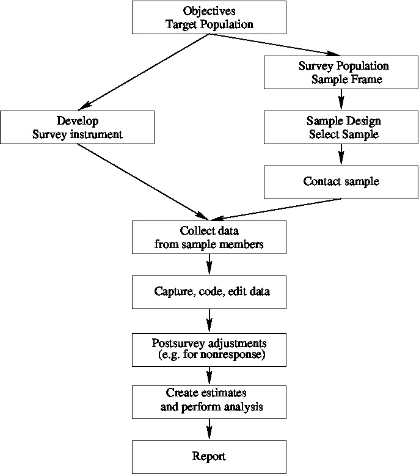
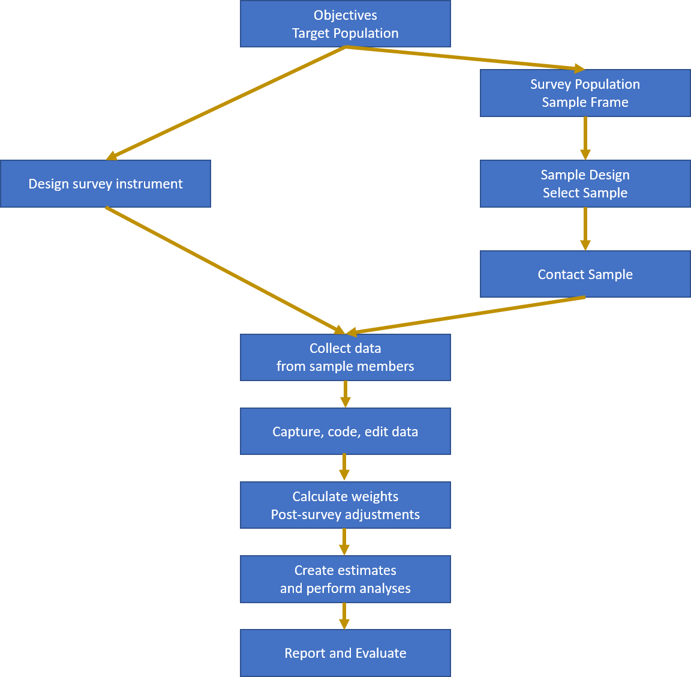
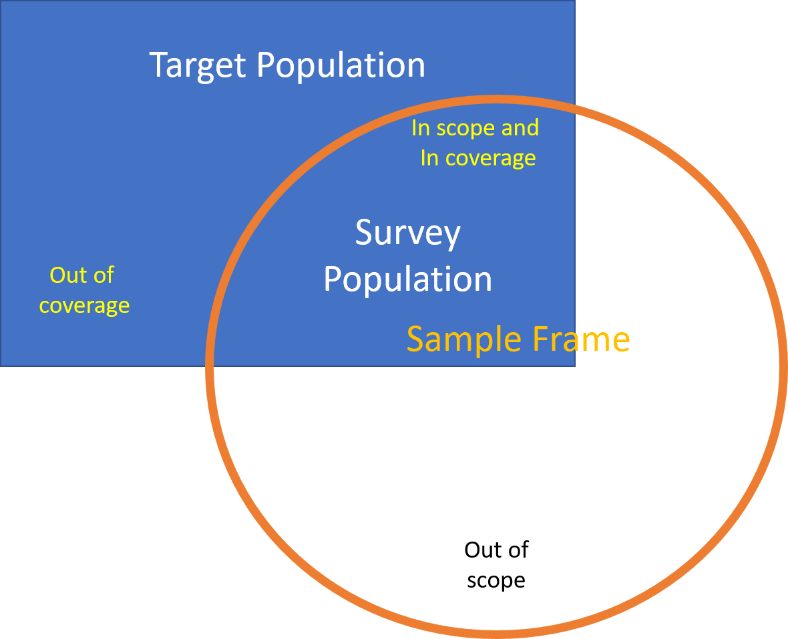

# Sample Surveys

A sample survey is an exercise in which **data** are collected from a 
**sample** (a subset) or a **population**.  The data collected are used to
create **estimates** of the characteristics or **parameters** of the
population.  

Some examples:

  * A sample of voters are telephoned to ask their voting intentions, with
  the aim of predicting the outcome of the election;
  * A sample of sites in a river catchment is tested for the presence of
  algae to determine the spread of the algae throughout the entire catchment;
  * A sample of households is selected, and the residents asked about their
  employment status, in order to estimate the national unemployment rate.

A **census** is a special case of a sample survey in which every member of
the population is surveyed.

## The Survey Process

The different steps in the survey process are shown in Figure \@ref(fig:survey-process1).

```{r survey-process1, fig.cap="The Survey Process", out.width='100%', echo=FALSE, fig.align="center"}
#

```

  * Every survey has a set of **objectives** -- the particular populations
  which are of interest;
  * These parameters are properties of the **target population**: the
  population about which estimates are to be made;
  * Not all members of the target population are able to be identified: the
  ones that can be surveyed make up the **survey population**;
  * The **sample frame** is a listing of all members of the survey
  population;
  * The **sample design** is the method of selecting the sample from the
  frame.  The **sample size** is usually decided as a compromise between the 
  required **accuracy of estimates** and the survey **costs** and other
  constraints (e.g. the time available for the survey);
  * **survey instrument** is the means of data collection.  It is
  usually a paper or electronic questionnaire, completed by the respondent or
  the interviewer/observer.  The instrument aims to measure the properties of
  the sample members which mean that the desired population characteristic can
  be estimated.  The instrument must be **valid** (it must actually measure
  what it intends to measure) and **reliable** (repeated measurements of the
  same sample member under identical circumstances should always yield similar
  results);
  * The sample members are **contacted** and **recruited** into the
  sample.  Not all selected members will be able to be contacted (even after
  strenuous efforts), and some will not respond even if contacted;
  * The data are collected from the sample members in some **mode**
  (e.g. face-to-face, telephone, web, observational, ...);
  * The data collected are **captured** (stored on a computer); **coded**
  (converted into standard classification systems); **edited** (checks for
  data consistency); and **stored** in a final dataset;
  * The data may be **adjusted**, e.g. imputation or weight adjustments
  for nonresponse may be done;
  * **Estimates** of the parameters of interest are constructed, and other
  **analysis** of the data is carried out (e.g. regression estimation,
  comparison with other data etc.);
  * The results are summarised in a **report**;
  * The original data may be **archived** in some appropriate form,
  or **destroyed**;
  * A post-survey **evaluation** may be made to determine how well the survey
  met its goals.

For example: The Household Labour Force Survey (HLFS).

  * One of the main **objectives** of the HLFS is to estimate the
  unemployment rate every quarter;
  * The **target population** is the working age population of
  New Zealand;
  * The **survey population** is the civilian, non-institutionalised
  usually resident population of adults aged 15+ 
  living in permanent, private dwellings on the main islands of New
  Zealand (North Island, South Island and Waiheke Island);
  * The **sample frame** is a list of dwellings created at the most recent
  census and regularly updated to reflect changes;
  * The **sample design** is a stratified cluster design.  Within each regional
  government area a sample of small areas (PSUs) is selected.  A sample of
  households is selected from within each PSU.  Every adult from the selected
  households is surveyed.  15000 households and 30000 adults are surveyed every
  three months, in order to create unemployment estimates accurate to within
  $0.5$%. 
  * The **survey instrument** is an electronic questionnaire.
  * The interviewers contact the households in person or by telephone,
  making up to 10 call backs to ensure contact is made.  **Proxy responses**
  are permitted (i.e. one household member can respond on behalf of another).
  The interview takes place by computer assisted personal or telephone
  interviewing (CAPI or CATI).
  * The results are **post-stratified** to match the current population estimates
  in each local government area;
  * **Estimates** of the unemployment rate are published within about 6
  weeks of the end of the quarter.


## Populations and Frames

The target population defines the **scope** of the survey: the set of units
which make up the population in which we are interested.

The sample frame is a method of gaining access to the members of the target
population.  It is an actual or conceptual list.  However it may not be
perfect (Figure \@ref(fig:scope-coverage)). 

 * Not all members of the target population will appear on the sample frame:
  the missing units are **out of coverage**;
 * Not all units listed on the sample frame are members of the target
  population:  the extra units are **out of scope**.
 * The survey population are those units which are both in the target
  population (in scope) and on the frame (in coverage).

Our aim is to have a sample frame which covers most if not all of the target
population, and which has only very few out of scope units.  

The reason for this is very important: we can make estimates about units in a population
**only** if they are included in the sample frame.  This inference is possible
**whether or not we select them**.  If there is a subpopulation of units that is
not on our frame (i.e. they are out of coverage) then we can never select them, we
can never learn anything about them, and therefore we cannot make inferences about them.

```{r scope-coverage, fig.cap="Scope and Coverage", out.width='70%', echo=FALSE, fig.align="center"}

```

### What is a sampling frame?

The sampling frame is a key element in the survey process which provides the
basis from which a *random* (probability based) sample can be selected.  The
purpose of having a sampling frame is to enable each member of the target
population a nonzero probability of being selected to participate in the
survey.  The *quality* of the data, from a survey which has as its basis a
comprehensive frame, can be *measured and controlled*.

The term sampling frame is sometimes misunderstood, often being thought of as a
list containing each member of the population. In fact that is more a
description of an `ideal' sampling frame.  The best way to show what a sampling
frame can be in practice is to examine some examples:

 * **List Frames.** Good up-to-date lists make ideal frames.  However lists of
  units (electoral rolls, telephone listings etc.)  are generally formed for
  purposes other than for use as sampling frames.  For this reason they are
  often not close to `ideal' sampling frames.  Some discussion of list frame
  problems comes later.
  
 * **Multi-stage Sampling Frames.** These frames consist of a set of lists
  which are arranged in a hierarchy of stages. For example a typical household
  survey frame will be organised like so: The first list is a a set of
  non-overlapping geographic areas from which a sample of areas is taken. For
  example we may list all the local regional councils and take a sample of
  them.  Within these areas we might then list all the households and take
  samples from the household lists. From each household we would then list the
  residents and interview selections of them.  Note that we do not have to list
  the entire population. The only comprehensive list needed is the list of the
  areas which will be quite small.  By giving each area a chance of being
  selected we ensure each person living in each area has a chance of selection.
  
 * **Continuous Sampling Frames.** Consider the population of people entering a
  country from international flights.  Suppose we choose a random number
  between one and ten ($=k$) and then interview the $k$th, $(k+10)$th,
  $(k+20)$th ... persons who file through customs.  We will have a sample where
  every person has had a 1 in 10 chance of being selected. But what is the
  frame? There is no list.  We call such a situation a `conceptual list', where
  the people filing into the country effectively formed a long queue of people
  which we have treated like a listing of the population, although a listing of
  names was never constructed.  \end{description}

One can find many different definitions of sampling frames. The following is a
simplified definition that should serve our purposes:

>  A *sampling frame* is part of the system of rules and procedures used when
>  determining who is to be surveyed and which ensure that each member of the
>  population get some measurable (non-zero) chance of participating in the
>  survey.

The examples above show that we need to think beyond the concept of a list of
units, whose construction is a separate exercise from the other survey stages.

### What is a *good* sampling frame?

We will often have several frames available and will have to decide between
different options. To help us with this decision we need to be a little more
specific about what makes a good sampling frame.  The first thing we should
consider is the effective coverage of the sampling frame. This can be
determined by testing it for the following properties:

 * **Each unit should be counted at least once**.  If there are missing
  units (out of coverage) then the survey results may be biased if the excluded
  units tend to be different to the units which are included.
  
 * **Each unit should be counted only once**. The problem is that we
  usually can not tell how many times a unit is duplicated. This means we can
  not tell how many chances a unit has of being sampled.  This can cause
  similar bias if the units which are duplicated are different to the other
  units.  The results will be biased towards the duplicated sub-group of the
  population.
  
 * **Each unit should be distinguishable from the other units on the
    frame**.  If we select a unit from the frame (say Jane Smith) but then can
  not tell who this refers to, when there are many Jane Smiths in the
  population, then the frame has not done its job.
  
 * **Should provide up-to-date information about the units**. For example
  it if it claims to provide Jane Smith's address it should be the current
  address.
  
 * **No units should be there if they are not meant to be**. Extra units
  (out of scope) are not a serious problem unless we fall into the elementary
  error of replacing them whenever we come across them in the sample. This
  confuses selection probabilities. The correct procedure is to drop any
  ineligible unit found in the sample and not replace them.
  
 * **Should allow direct access to each unit**. Ideally the frame will
  ultimately supply us with a list of the units we are interested in analyzing.
  Sometimes a frame will only give samples of groups of units e.g. a list of
  addresses, each of which may contain many people. Further work is needed
  before a sample of people is realized.

## Approaches to sampling

We're talking here about random sampling, or **probability sampling**.  For
the purposes of statistical inference such sampling is the only defensible method -
it's the only one that leads us to properly constructed confidence intervals 
and hypothesis tests.  Other approaches do exist though, and even though you'll see
them used they all have significant defects.

* **Probability sampling** is the gold standard: every member of the population
  has a known, non-zero chance of selection;
* **Purposive sampling**: the surveyor selects members of the population that 
  they consider to be representative - dangerously biased towards the views
  and prejudices of the surveyor;
* **Haphazard sampling**: the surveyor uses any members of the population that
  they come across. This is what happens on the street corner when you're asked
  questions by a surveyor;
* **Quota sampling**: resembles stratified sample (see later): the surveyor fills
  quotas of respondents to balance numbers of respondents in categories (e.g. by 
  age/gender/ethnicity), but does not make an accounting for non-response (see later);
* **Snowball sampling**: used in rare populations that are highly connected (e.g.
  refugees from a particular country): existing sample members recruit new sample
  members using their contacts;
* **Self-selected sampling**: this is the **worst** of all: the respondents themselves
  decide whether to be selected: they see an advertisement on a webpage or phone
  in with their views.  Only profiles motivated population members - the silent
  majority are never measured.

## Example datasets

We'll use and re-use a number of standard datasets.

### API

This is a dataset on Student performance in California schools.  The dataset is distributed with the `survey` library in R, and there are a number of unit record datasets which are drawn from a population dataset `apipop` under various sample designs.   The population units are the schools, and a number of characteristics are available.  Full documentation can be found in the `survey` package.  The variables we use mostly are:

  * `stype` - School type (Elementary/Middle/High School)
  * `snum` - School number
  * `dnum` - District number
  * `api99` - Academic Performance Indicator for the school in the year 1999
  * `api00` - Academic Performance Indicator for the school in the year 2000
  * `sch.wide` - Did the school meet its school-wide growth target?
  * `awards` - Is the school eligible for an awards program
  * `meals` - Percentage of students eligible for subsidised meals
  * `ell` - Percentage of students that are English Language Learners
  * `grad.sch` - Percentage of students with parents with a postgraduate education
  * `enroll` - Number of students enrolled
  * `api.stu` - Number of students tested in the API


### From the dplyr package

* `starwars` - a list of characteristics of 87 characters from the Star Wars
  movie series;
  
  

  


