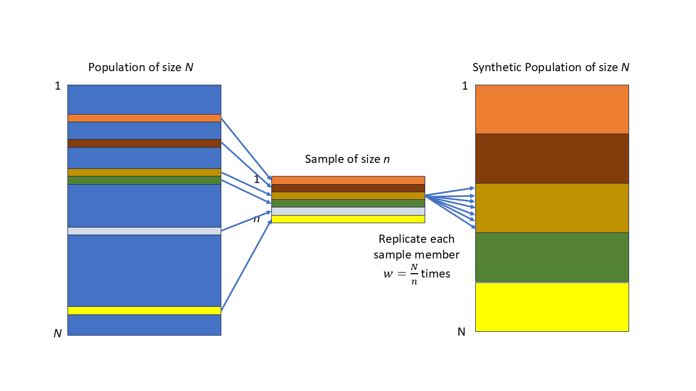

# Statistical Inference

<!--- For HTML Only --- Equivalent code for .pdf must be included in preamble.tex -->
`r if (!knitr:::is_latex_output()) '
$\\DeclareMathOperator*{\\argmin}{argmin}$
$\\newcommand{\\var}{\\mathrm{Var}}$
$\\newcommand{\\bfa}[2]{{\\rm\\bf #1}[#2]}$
$\\newcommand{\\rma}[2]{{\\rm     #1}[#2]}$
$\\newcommand{\\estm}{\\widehat}$'`

## Inference in infinite populations

Let's briefly review a few familiar results from earlier statistics courses.

Most of what we've done in earlier courses has assumed that we have
a **simple random sample** from an **infinite** population.

We'll use data from the `starwars` dataset (in the `dplyr` package).  There
are data on 87 characters, including their heights in centimetres.  
Six heights are missing, but let's just guess them so we have no missing data
(this process of inventing data has a respectable name:  **'imputation'**, 
and we'll come back to it later).

```{r}
library(dplyr)
data(starwars)
sum(is.na(starwars$height))
starwars <- starwars |> 
  mutate(height=case_when(name=="Arvel Crynyd" ~ 172, # same as Luke
                          name=="Finn" ~ 172, # same as Luke
                          name=="Rey" ~ 150,  # same as Leia
                          name=="Poe Dameron" ~ 172, # same as Luke
                          name=="BB8" ~ 96, # same as R2D2
                          name=="Captain Phasma" ~ 167, # same as C3P0
                          .default=height))
```

The mean height $\bar{Y}$ of characters in the Star Wars universe is a **population parameter**.
We can **estimate** it from a sample of characters.  

> **Note:** we're using capital letters for **population parameters** 
> ($\bar{Y}$ is the population mean), and lower case letters for **sample statistics**
> ($\bar{y}$ is the sample mean).
> 
> It's also common to see Greek letters for **population parameters** (e.g. $\mu$ for the
> population mean), upper case latin letters for random variables, and lower case latin letters
> for sample statistics.  

For the purposes of this exercise let's imagine there are only $N=87$ individuals in the entire 
Star Wars universe. Let's draw a random sample of $n=20$ from this population of $N=87$:
```{r}
set.seed(222)
bigN <- nrow(starwars)
n <- 20
samplemembers <- starwars[sample(bigN, n, replace=FALSE),]
samplemembers |>
  dplyr::select(name,height,mass,hair_color,homeworld) |>
  kbl() |>
  kable_styling()
```

```{r starwarssample, echo=FALSE} 
#| fig.align='center',
#| fig.width=5,
#| fig.cap="Histogram of heights of a sample of Star Wars characters (vertical line at the sample mean)"
hist(samplemembers$height, xlab="Height (cm)", ylab="Frequency", 
     breaks=15, main="Heights of Star Wars characters")
abline(v=mean(samplemembers$height),col="red",lwd=2)
```

Compute the sample mean $\bar{y}$ and standard deviation $s_y$:
```{r}
ybar <- mean(samplemembers$height)
ybar
sdy <- sd(samplemembers$height)
sdy
```

```{r echo=FALSE}
tstar <- qt(0.05/2, df=n-1, lower.tail=FALSE)
se <- sdy/sqrt(n)
moe <- tstar*se
ci <- ybar + moe*c(-1,1)
fpc <- sqrt(1-n/bigN)
sefpc <- se*fpc
moefpc <- moe*fpc
cifpc <- ybar + moefpc*c(-1,1)
```

We know how to make a point estimate $\widehat{\bar{Y}}$ for the population
mean $\bar{Y}$ (remember that a hat $\widehat{.}$ over a symbol indicates 
an estimate of that parameter): the population mean is estimated by the sample
mean $\bar{y}$:
\[
    \widehat{\bar{Y}} = \bar{y} = `r sprintf("%.1f",ybar)`
\]
and a 95% confidence interval is given by
\begin{eqnarray}
    \widehat{\bar{Y}} \pm \bfa{MOE}{\widehat{\bar{Y}}}
    &=& \widehat{\bar{Y}} \pm T^\ast_{n-1}\times \bfa{SE}{\widehat{\bar{Y}}}\\
    &=&  \bar{y} \pm T^\ast_{n-1}\times\frac{s_y}{\sqrt{n}}\\
    &=& 
    `r sprintf("%.1f",ybar)` \pm `r sprintf("%.2f",tstar)` \times \frac{`r sprintf("%.1f",sdy)`}{\sqrt{`r n`}}\\
    &=& 
    `r sprintf("%.1f",ybar)` \pm `r sprintf("%.2f",tstar)` \times `r sprintf("%.2f",se)`\\
    &=& 
    `r sprintf("%.1f",ybar)` \pm `r sprintf("%.1f",moe)`\\
    &=& 
    `r sprintf("(%.1f,%.1f)",ci[1],ci[2])`
\end{eqnarray}

Here:

* $\bfa{SE}{\widehat{\bar{Y}}}$ is the **standard error** or **sampling error** of the 
  estimator $\widehat{\bar{Y}}$ of the population mean $\bar{Y}$;
* $T^\ast_{n-1}$ is the quantile of the $t-$distribution with $n-1$ degrees of
  freedom so that the interval $[-T^\ast_{n-1},+T^\ast_{n-1}]$ encloses 95% of the probability
  of the $t-$distribution;
* $\bfa{MOE}{\widehat{\bar{Y}}}$ is the **margin of error**, the half-width of the confidence interval, 
  and is the standard error scaled by $T^\ast_{n-1}$.

This is what is known as a **model based** estimate, the statistical model being
\begin{equation}
   y_i = \mu + \varepsilon_i \qquad \text{where $\varepsilon_i\overset{\rm iid}{\sim} N(0,\sigma^2)$}
   (\#eq:simplelinearmodel)
\end{equation}
There are just two parameters here: the population mean $\mu$, and the population 
standard deviation $\sigma$.

We can fit this simplest of all linear regression models using the `lm()` function and 
get the same results:
```{r}
lm1 <- lm(height ~ 1, data=samplemembers)
summary(lm1)
confint(lm1)
```

Here `(Intercept)` is the estimate for $\mu$, the population mean.  
The 'residual standard error' in the R output is actually what we'd rather
call $\widehat{\sigma}$, our estimate of the standard deivation $\sigma$.  

The confidence interval is only valid if the model in equation \@ref(eq:simplelinearmodel) 
holds: i.e. if the data are normally distributed about the mean.  The histogram
in Figure \@ref(fig:starwarssample) suggests that this is not the case however, since
there is a clear outlier at low height.  

> The Central Limit Theorem (CLT) tells us that if $n$ is large enough then our
> estimate for $\mu$ is useable, and its confidence interval realistic, even 
> if the model in equation \@ref(eq:simplelinearmodel) doesn't actually hold.  
> 
> The CLT enables much of statistcal practice to yield meaningful results even
> without our knowing the true data generation model. 
> 
> In this course most of the examples will have sample sizes large enough
> that the CLT will mean our results are valid.  In these cases when
> constructing a confidence interval it will 
> be sufficient to replace $T^\ast_{n-1}$ with the equivalent $Z^\ast=1.96$
> from the Normal distribution.  

## Inference in finite populations

Recall that the standard error of an estimate is the variability
of estimates between different samples: in fact it is defined as the standard deviation
of all possible estimates from all possible estimates drawn using the
same sample design. 

In an infinite population there are an infinite number of possible samples.

However in a finite population that isn't the case.  In a population of size $N$
if we draw a simple random sample without replacement of size $n$ there are
\begin{eqnarray}
    \binom{N}{n} &=& {}^NC_n\\
                 &=& \frac{N!}{n! (N-n)!}\\ 
                 &=& \frac{N\times (N-1)\times (N-2)\times ... \times (N-n+1)}{
                           n\times (n-1)\times (n-2)\times ... \times 1}
\end{eqnarray}
possible samples: i.e. the number of ways it is possible to draw $n$ objects
from a collection of $N$ without regard to the order they are selected.

In our example of selecting $n=20$ from $N=87$ there are an astronomical
number of possible samples:
\[
   \binom{87}{20} = \frac{87!}{20!67!} = 2.38\times 10^{19}
\]
There is of course only one way to select a census though:
\[  
   \binom{87}{87} = \frac{87!}{87!0!} = 1
\]
(using the at first face slightly annoying definition 0!=1).  Since there's only 
one possible sample when we're drawing a census the variation among sample estimates 
from different samples is zero: i.e. the standard error is zero.  

It's also true that if $n$ is close to $N$ then sample estimates hardly differ from
one another.

We clearly need a modification of our standard error formula
\[
   \bfa{SE}{\widehat{\bar{Y}}} = \frac{s_y}{\sqrt{n}}
   \qquad \text{(Infinite population)}
\]
to allow for sample sizes $n$ being close to the population size.

That modification is the **finite population correction (fpc)**:
\[
   \bfa{SE}{\widehat{\bar{Y}}} = \sqrt{1-\frac{n}{N}}\times\frac{s_y}{\sqrt{n}}
   \qquad \text{(Finite population)}
\]
The factor $\sqrt{1-n/N}$ squashes the standard error to zero in the case that $n=N$, 
but for very small $n$ has a value close to 1, and makes no difference at all.

In our example we had a standard error of
\begin{eqnarray}
  \bfa{SE}{\widehat{\bar{Y}}} &=& \frac{s_y}{\sqrt{n}}\\
                              &=& \frac{`r sprintf("%.1f",sdy)`}{\sqrt{`r n`}}\\
                              &=& `r sprintf("%.2f",se)`
\end{eqnarray}
If we incorporate the fpc this becomes
\begin{eqnarray}
  \bfa{SE}{\widehat{\bar{Y}}} &=& \sqrt{1-\frac{n}{N}}\times\frac{s_y}{\sqrt{n}}\\
                              &=& \sqrt{1-\frac{`r n`}{`r bigN`}}\frac{`r sprintf("%.1f",sdy)`}{\sqrt{`r n`}}\\
                              &=& `r sprintf("%.4f",fpc)` \times \frac{`r sprintf("%.1f",sdy)`}{\sqrt{`r n`}}\\
                              &=& `r sprintf("%.2f",sefpc)`
\end{eqnarray}
This narrows the confidence interval for the estimate of the population mean height 
from `r sprintf("(%.1f,%.1f)", ci[1], ci[2])`
to `r sprintf("(%.1f,%.1f)", cifpc[1], cifpc[2])`.

This is a **design based** confidence interval, in which it is the sample design
which foremost in our derivation of standard errors.  

There is quite a lot of theory behind derivation of standard errors in the complex
designs which arise in sample surveys.  

The `survey` package in R implements the consequences of sample designs which will 
mean we can use the theory without having to derive it.  

For example here's a call to some `survey` package functions which
gives us the effect of the fpc in our example:
```{r}
samplemembers$bigN <- bigN
ss <- svymean(height~1, design=svydesign(ids=~1, fpc=~bigN, data=samplemembers))
ss
confint(ss)
```

If you're interested in the theory take a look at a text like @cochran or @ssw. 

## The survey inference process

Sampling begins with the sample frame - usually this is a **list** of the
members, or **units**, which make up the population.  

The list contains at minimum some **identifier** of each unit, which enables
it to be found/contacted/measured once it has been selected, and possibly 
a lot of other information too.

Data that we have on the frame is called **auxiliary information**: it is
data that is available about a unit whether or not it has been sampled.  Some
sample designs rely on this auxiliary data during the process of sample selection. 

In probabilistic (random) sampling each unit $i$ has a known nonzero chance of
selection $\pi_i$, which may depend on the auxiliary data in some way. 
These probabilities don't have to be equal, just known and nonzero.

In random sampling we generate a random variable $I_i$ for each 
population member, based on the sample design, to decide whether it is 
selected into the sample or not:
\begin{equation}
   I_i = \begin{cases}
         1,\qquad &\text{if unit $i$ is selected}\\
         0,       &\text{otherwise}
         \end{cases}
\end{equation}
The sample size is just the sum of these random variables
\[
   n = \sum_{i=1}^N I_i
\]

```{r sampleframe, echo=FALSE}
ff <- data.frame(UnitID=c(1, 2, 3, "$\\vdots$", "$i$", "$\\vdots$", "N"),
                 X=c("${\\bf X}_1$","${\\bf X}_2$","${\\bf X}_3$",
                     "$\\vdots$","${\\bf X}_i$","$\\vdots$","${\\bf X}_N$"),
                 P=c("$\\pi_1$","$\\pi_2$","$\\pi_3$","$\\vdots$","$\\pi_i$","$\\vdots$","$\\pi_N$"),
                 I=c("$I_1$","$I_2$","$I_3$","$\\vdots$","$I_i$","$\\vdots$","$I_N$")
                 )
ff |>
  kbl(caption = "Sample Frame ($N$ rows)",
      col.names=c("Unit ID", "Data", "Probability", "Indicator"),
      escape=FALSE, align = 'cccc') |>
  kable_styling() |>
  add_header_above(c(" ","Auxiliary", "Selection", "Selection")) 
```

So we start with the $N$ rows of the sample frame (Table \@ref(tab:sampleframe)) generate
the sample indicators $I_i$, and reduce to the $n$ rows of data in Table \@ref(tab:sampledata).
For each member $k$ of the sample we know its population identifier $i_k$, its auxiliary information
${\bf x}_k$, selection probability $\pi_k$, and we also collect and record the survey data ${\bf y}_k$.  

```{r sampledata, echo=FALSE}
fs <- data.frame(Unit=c(1, 2, 3, "$\\vdots$", "$k$", "$\\vdots$", "$n$"),
                 UnitID=c("$i_1$", "$i_2$", "$i_3$", "$\\vdots$", "$i_k$", "$\\vdots$", "$i_n$"),
                 X=c("${\\bf x}_1$","${\\bf x}_2$","${\\bf x}_3$",
                     "$\\vdots$","${\\bf x}_k$","$\\vdots$","${\\bf x}_n$"),
                 P=c("$\\pi_1$","$\\pi_2$","$\\pi_3$","$\\vdots$","$\\pi_k$","$\\vdots$","$\\pi_n$"),
                 W=c("$w_1$","$w_2$","$w_3$","$\\vdots$","$w_k$","$\\vdots$","$w_n$"),
                 Y=c("${\\bf y}_1$","${\\bf y}_2$","${\\bf y}_3$",
                     "$\\vdots$","${\\bf y}_k$","$\\vdots$","${\\bf y}_n$")
                 )
fs |>
  kbl(caption = "Sample Data ($n$ rows)",
      col.names=c("Unit", "Unit ID", "Data", "Probability", "Weight", "Data"),
      escape=FALSE, align = 'ccccc') |>
  kable_styling() |>
  add_header_above(c("Sample"," ","Auxiliary", "Selection", "Sample", "Sample")) 
```

The **expected value** of each indicator variable is $\pi_i$
\begin{eqnarray}
    E[I_i] &=& 1\times\Pr(I_i=1) + 0\times\Pr(I_i=0)\\
           &=& 1\times\pi_i + 0\times(1-\pi_i)\\
           &=& \pi_i
\end{eqnarray}
Each selected sample member carries a **sample weight** which is the number of units
in the population that that unit represents.  These weights are defined as the 
inverses of the selection probabilities.
\[
   W_i = \frac{1}{\pi_i}
\]

Consider some characteristic $Y_i$ which each population member has.  e.g. in a 
survey of households we might be measuring the amount of money $Y_i$ that household
$i$ spends on internet streaming services.  The total amount of money spent by 
all households in the population combined is
\[
   Y = \sum_{i=1}^N Y_i
\]
However we only know $Y_i$ for some households: those which are selected, i.e.
those which have $I_i=1$.

The **Horwitz-Thompson** (HT) estimator of the population total is
\begin{eqnarray}
  \widehat{Y} &=& \sum_{i=1}^N I_i W_i Y_i\\
              &=& \sum_{k=1}^n w_k y_k
\end{eqnarray}
i.e. a weighted sum of the observed household spending values $y_k$ just for the $n$
selected households. ($I_i=0$ for any unselected households, so the sum of $N$ terms
simplifies to a sum of $n$ terms, just over the sample members.)

We can see that the HT estimator is **unbiased**: 
\begin{eqnarray}
  E[\widehat{Y}] &=& \sum_{i=1}^N E[I_i] W_i Y_i\\
                 &=& \sum_{i=1}^N \pi_i W_i Y_i\\
                 &=& \sum_{i=1}^N \pi_i \frac{1}{\pi_i} Y_i\\
                 &=& \sum_{i=1}^N Y_i\\
                 &=& Y
\end{eqnarray}
i.e. although the observed value $\widehat{Y}$ from a given sample may not equal the
true value $Y$, when averaged over all possible samples we can see that on average
it does equal the true population value.  

We also want the standard error $\bfa{SE}{\widehat{Y}}$ to be small, so that we have
precise estimates.

We're all familiar with the idea that the larger the sample size $n$ the smaller the 
standard error.  We now know that the standard error is going to crush down to zero 
in finite populations the closer we get to a census. 

There's a further advantage we can get by making a good choice of **sample design**.  
Two different methods of selecting a sample of the **same sample size $n$** may lead
to very different values of the standard error, and thus confidence intervals of 
very different widths.  

Incidentally, the expected value of the sum of the sample weights among sample members is equal to 
the population size:
\begin{eqnarray}
    \sum_{k=1}^n w_k &=& \sum_{i=1}^N I_i W_i\\
  E\left[\sum_{k=1}^n w_k\right] 
                      &=& \sum_{i=1}^N E[I_i] W_i\\
                      &=& \sum_{i=1}^N \pi_i W_i\\
                      &=& \sum_{i=1}^N \pi_i \frac{1}{\pi_i}\\
                      &=& \sum_{i=1}^N 1\\
                      &=& N
\end{eqnarray}

Here's one way to think about sample weights.  We have a population of size $N$
we want to make estimates about: what we'd really like is a dataset of all $N$ individuals.
Instead we only have $n<N$ individuals.   So we (conceptually) replicate each of the $n$
sampled indidividuals by their weight: this makes a new synthetic dataset which does
have the $N$ entries we're interested in.  Each row is identical to a number of others, 
however in the real population there are many individuals who sometimes very closely 
resemble each other.  So the properties of our synthetic population may be good enough 
for estimating the properties of the true population.  

The weight of a sample member indicates how many members of the population that
sample member represents.  If we had a population of size $N=100$ and a simple random 
sample of size $n=20$ then each sample member represents $w=100/20=5$ people in the 
population.  

In many designs the weights differ between individuals:
high weights mean that the sample member represents many other individuals.  A weight
of 1 means that sample member represents themself alone.

There's no problem with weights being fractions - since we only conceptually but 
don't **actually** replicate the data.

```{r weights, echo=FALSE} 
#| fig.align='center',
#| fig.width=5,
#| fig.cap="How weights work in SRSWOR: we want to make estimates about a population of size $N$, but only have a sample of size $n$: so we replicate each sample member $w=N/n$ times to generate a synthetic population of size $N$ which we can analyse."

```

## Example

We might have a small street of five houses.  Our frame is 
just the list of addresses.  We might know the household rateable value
from the City Council list of dwellings.

```{r echo=FALSE}
hframe <- data.frame(
  ID=c(6451,6452,8773,7164,6125),
  Address=c("1 Chestnut Place","2 Chestnut Place","2A Chestnut Place",
            "3 Chestnut Place","4 Chestnut Place"),
  Value=c(1.201, 0.780, 0.520, 2.530, 0.900)
)
hframe |>
  kbl(col.names=c("ID","Address","Value ($M)"), 
      align='clc') |>
  kable_styling()
```

We might then select a simple random sample of $n=2$ houses
from the $N=5$ in the small street.  The probability of selection is $\pi_i=2/5$ 
for each house.  We draw our random sample and select house number 2A and 
house number 5 into our sample.

```{r echo=FALSE}
hframe$prob <- rep(0.4,5)
hframe$selected <- c(0,0,1,0,1)
hframe |>
  kbl(col.names=c("ID","Address","Value (\\$M)","Prob. $\\pi_i$", "Selected, $I_i$"), 
      align='clccc', escape=FALSE) |>
  kable_styling()
```

We visit each selected house and ask how much they spend $y_k$ on all their internet streaming
services each month.  

```{r echo=FALSE}
dframe <- hframe[hframe$selected==1,]
dframe$weight <- 1/dframe$prob
dframe$y <- c(75, 19)
dframe$prob <- NULL
dframe$selected <- NULL
dframe |>
  kbl(col.names=c("ID","Address","Value (\\$M)","Weight $w_k$", "Internet spend, $y_k$"), 
      align='clccc', escape=FALSE) |>
  kable_styling()
```

```{r echo=FALSE}
n <- 2
N <- 5
ybar <- mean(dframe$y)
sy <- sd(dframe$y)
se <- sqrt(1-n/N)*sy/sqrt(n)
tstar <- abs(qt(0.025,n-1))
tstar <- 1.96
moe <- tstar*se
ci <- ybar + moe*c(-1,1)
ytot <- N*ybar
citot <- N*ci
```

Each house in the sample has a weight of 2.5 = 5/2: i.e. it represents itself and 1.5 other houses
in the street.  The sum of the weights of the two selected houses is equal to the population size 
$N=5$.

Our sample is really too small to do any sensible inference on: but let's do it anyway to show how things 
work.  We calculate the mean and standard deviation of the monthly internet streaming values: 
$\bar{y}=`r sprintf("\\$%.2f",ybar)`$, and $s_y=`r sprintf("\\$%.2f",sy)`$.

Our estimate of the mean monthly spend is $\bar{y}=`r sprintf("\\$%.1f",ybar)`$, with a margin of error of
\begin{eqnarray}
   \bfa{MOE}{\widehat{\bar{Y}}} 
   &=& Z^\ast\sqrt{1-\frac{n}{N}}\times\frac{s_y}{\sqrt{n}}\\
   &=& 1.96\sqrt{1-\frac{2}{5}}\times\frac{`r sprintf("\\$%.2f",sy)`}{\sqrt{2}}\\
   &=& `r sprintf("\\$%.2f",moe)`
\end{eqnarray}
which gives a 95% confidence interval of `r sprintf("(\\$%.2f,\\$%.2f)",ci[1],ci[2])` (although
the use of the large sample value $Z^\ast=1.96$ is very much **not** justified here.)

In finite populations we are sometimes interested in population totals - which don't make any 
sense in infinite populations.   Now we have an estimate of the mean spend per house, we can 
scale it up by the population size to see how much per month is being spent by all of the houses
combined:
\begin{eqnarray}
  \widehat{Y} &=& N\widehat{\bar{Y}}\\
              &=& 5\times `r sprintf("\\$%.2f",ybar)`\\
              &=& `r sprintf("\\$%.2f",ytot)`
\end{eqnarray}
and we can scale the confidence interval up in the same way
\begin{eqnarray}
  \bfa{CI}{\widehat{Y}} &=& N\bfa{CI}{\widehat{\bar{Y}}}\\
                        &=& 5\times `r sprintf("(\\$%.2f,\\$%.2f)",ci[1],ci[2])`\\
                        &=& `r sprintf("(\\$%.2f,\\$%.2f)",citot[1],citot[2])`
\end{eqnarray}
