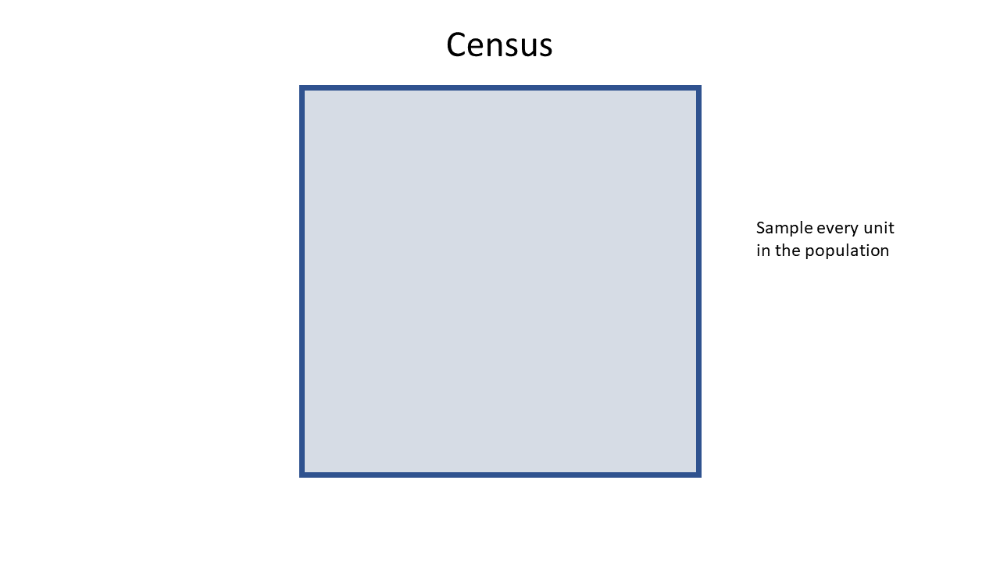
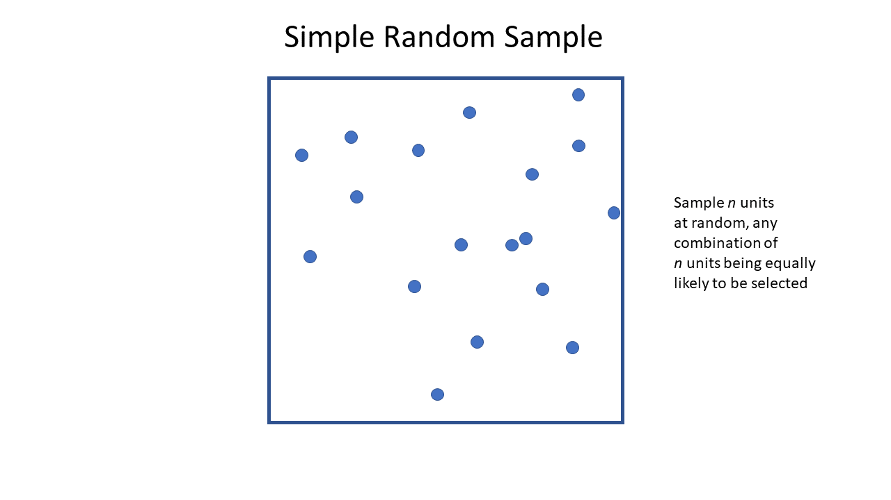
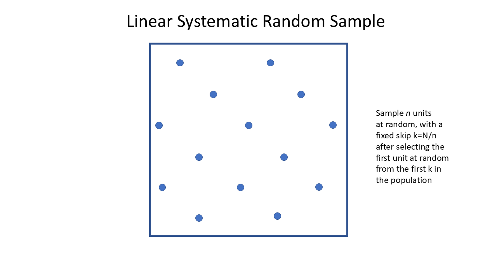
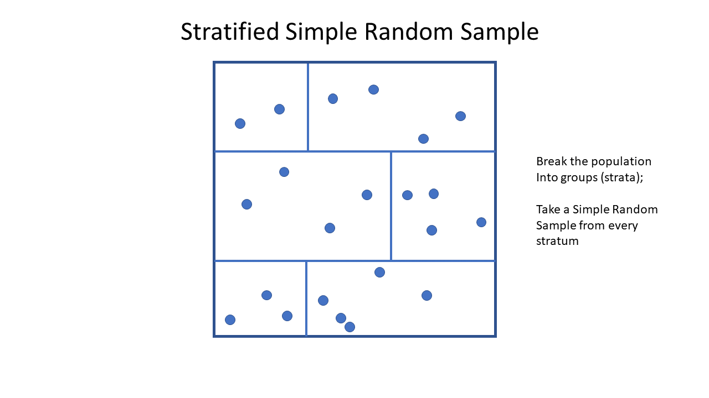
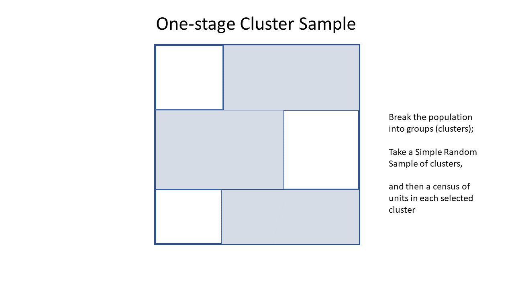
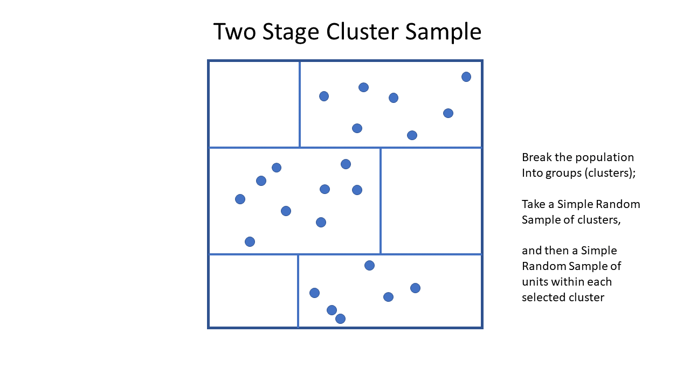

# Sample Designs

In this Chapter we will consider the various sample designs in common
use, the reasons for using each one, and methods for selecting from suitable
frames.  

We'll use a variety of datasets.

## Census

The simplest of all!  We select every unit in the population, so $n=N$.

The probability of selection is
\[
   \pi = \frac{n}{N} = \frac{N}{N} = 1
\]
i.e. every unit is selected with certainty, and the sample weights are all
\[
   w_i = \frac{1}{\pi_i} = \frac{1}{1} = 1
\]
so each unit in the sample represents itself alone. 

```{r census, echo=FALSE}
#| fig.align='center',
#| fig.width=5,
#| fig.cap="Census"

```

### Design considerations {-}

None: we're sampling all $N$ members of the population.

## Simple Random Sampling Without Replacement (SRSWOR)

The Simple Random Sample WithOut Replacement is the most fundamental of all
sample designs, and it appears nested inside many more complex designs as we'll see later.  

We have a population of size $N$ which is fully enumerated (i.e. fully listed), and
we want to select a sample of size $n$.

The defining property of a SRSWOR is that all samples of size $n$ have an equal chance
of selection.  A **consequence** of this definition is that all population units have 
the same chance of selection.

There are 
\[
   \binom{N}{n} = {}^NC_n = \frac{N!}{n!(N-n)!} 
\]
possible samples.  The R function `choose(n,k)` can be used for evaluating the number
of possible samples.  e.g. the number of ways to select $n=20$ units from $N=87$ is  
```{r}
choose(87,20)
```

The probability of selection of each unit is
\[
   \pi_i = \frac{n}{N}
\]
leading to sample weights
\[
   w_i = \frac{N}{n}
\]
The SRSWOR is used when the **costs** of different samples are not known to differ
(e.g. there are no units that are more costly to visit than others), and where
there is no informative auxiliary information.  

If we have a sample frame stored as an R data frame `sframe` with a column `ĪD` uniquely 
identifying the units, then we can select an SRSWOR as follows:

```{r eval=FALSE}
bigN <- nrow(sframe)
samp <- sframe[sample(bigN,n),]
samp$weight <- bigN/n
```
or
```{r eval=FALSE}
bigN <- nrow(sframe)
IDset <- sample(sframe$ID,n)
samp <- sframe[sframe$ID %in% IDset,]
samp$weight <- bigN/n
```
or as a function 
```{r}
select.srswor <- function(df, n) {
  # SRSWOR
  bigN <- nrow(df)
  if(n<=bigN) {
    samp <- df[sample(bigN,n,replace=FALSE),]
    samp$bigN <- bigN
    samp$weight <- bigN/n
  } else {
    stop("Cannot have a SRSWOR with n>N")
  }
  return(samp)
} 
```


```{r srswor, echo=FALSE}
#| fig.align='center',
#| fig.width=5,
#| fig.cap="Simple Random Sample WithOut Replacement (SRSWOR)"

```

### Design considerations {-}

* We only need to decide on the sample size $n$ (see later).

### Example {-}

Select $n=5$ units from a frame listing of airports with IATA codes 
sourced from Kaggle https://www.kaggle.com/datasets/syedasimalishah/airports/data

```{r echo=FALSE}
airports <- read.csv("data/airports_w_headers.csv",encoding="UTF8")
names(airports) <- c("ID","Name","City","Country","IATA","ICAO",
                     "Latitude","Longitude","Altitude","TimeZoneHours","DST","TimeZoneName","Type","Source")
airports <- airports[order(airports$IATA),]
airports <- airports[airports$IATA!="",]
airports$ID <- 1:nrow(airports)
row.names(airports) <- NULL
```

The top ten rows of the dataset of $N=`r nrow(airports)`$ are shown here:
```{r echo=FALSE}
airports[1:10,c("ID","IATA","Name","City","Country","Latitude","Longitude")] |>
  kbl(row.names=FALSE) |>
  kable_styling()  
```

And here is a SRSWOR of $n=5$ airports
```{r}
samp <- airports |> select.srswor(n=5)
```

```{r echo=FALSE}
samp[,c("ID","IATA","Name","City","Country","Latitude","Longitude","bigN","weight")] |>
  kbl(caption="Sample of airports (SRSWOR)",row.names=FALSE) |>
  kable_styling()
```

## Simple Random Sampling With Replacement (SRSWR)

This design is rarely used, but is the simplest form of Probability Proportional to Size 
With Replacement (PPSWR) sampling, but with the sizes all equal.  

Sampling proceeds in principle by selecting one unit at a time where each unit has a $1/N$
chance of being selected each time.  After $n$ draws the probability a unit has been selected
at least once is 
\[
    p_i = 1 - \left(1-\frac{1}{N}\right)^n
\]
(This is 1 minus the chance that a unit is not selected on any of the $n$ sampling occasions.)

If $n$ is tiny compared to $N$, $p_i$ is approximately $n/N$ which is the SRSWOR selection 
probability.  In practice we assign a weight of $N/n$ to each unit as it is selected, so if unit
$i$ is selected $m_i$ times then it ends up with a weight of 
\[
   w_i = m_\frac{N}{n}
\]   
If we use the approximate weights calculated in this way we have what is known as the 
Hansen-Hurwitz estimator, rather than the Horwitz-Thompson estimator.  However we think of 
the weights in the same way and this distinction need not concern us. 

### Design considerations {-}

As in a SRSWOR, we only need to decide on the sample size $n$.

### Example {-}

Here is a SRSWR of $n=5$ airports: note that we have aggregated
across any instances of multiple selections, so that in the output
sample list each unit appears only once no matter how often it was selected.
```{r eval=FALSE}
bigN <- nrow(airports)
n <- 5
samp <- airports[sample(bigN,n,replace=TRUE),]
samp$weight <- bigN/n
samp <- samp |>
  group_by(ID) |>
  summarise(across(-weight, first), nsampled=n(), weight=sum(weight))
```
or as a function
```{r}
select.srswr <- function(df, n) {
  # SRSWR
  bigN <- nrow(df)
  df$rownames <- 1:bigN
  samp <- df[sample(bigN,n,replace=TRUE),]
  samp$bigN <- bigN
  samp$weight <- bigN/n
  samp <- samp |>
    group_by(rownames) |>
    summarise(across(-weight, first), nsampled=n(), weight=sum(weight)) |>
    as.data.frame() |>
    ungroup() |>
    select(-rownames)
  return(samp)
} 

samp <- airports |> select.srswr(n=5)
```


```{r echo=FALSE}
samp[,c("ID","IATA","Name","City","Country","Latitude","Longitude","nsampled","weight")] |>
  kbl(caption="Sample of airports (SRSWOR)") |>
  kable_styling()
```

## Probability proportion to size Sampling (PPSWR)

This sample design generalises the SRSWR design to unequal probabilities of 
selection.  This design recognises that some units may have more influence on 
our estimates because of some **size** property that is known (it must be on the
frame).  We therefore give these units higher probabilities of being selected, 
and therefore lower weight.

We draw $n$ units, one at a time, but with probabilities which are proportional to 
the size measure $X_i$: thus the probability of selection of unit $i$ on each
of the $n$ draws from the population is
\[
   p_i = \frac{X_i}{\sum_{j=1}^N X_j}
\]
Approximating the probability of selection $\pi$ after $n$ draws as $np_i$
leads to the sample weights
\[
   w_i = \frac{1}{np_i}
\]
In a PPSWR sample these weights are not guaranteed to add up to the population size.

### Design considerations {-}

We need to decide on:

* the size variable $X_i$ (which must be known for every unit in the population), and
* the sample size $n$.

The size variable $X_i$ should correlate in some way with the population characteristics
we want to estimate.  If we're interested in estimating the total economic output of 
businesses, then the amount of tax each business paid last year would be a good size 
variable.  But it wouldn't be helpful if we were interested in estimating the 
proportion of businesses with family friendly employment practices. 

With replacement designs lose some efficiency because their estimators do not 
incorporate a finite population correction in their standard errors.
For small sampling fractions (i.e. small $n/N$) this is not a significant drawback.  

### Example {-}

```{r echo=FALSE}
pop <- read.csv("data/population.csv")
pop <- pop |> filter(Year==2023) |> 
  rename(Country=Entity, Population=all.years) |>
  arrange(Country) 
pop <- pop[!grepl("^OWID_",pop$Code),]
pop <- pop[!grepl("^UN_",pop$Code),]
pop <- pop[pop$Code!="",]
pop$Prob <- pop$Population/sum(pop$Population)
row.names(pop) <- NULL
bigN <- nrow(pop)
```

We have a list of $N=`r bigN`$ countries and their 2023 populations: 
the first 10 are listed below
```{r echo=FALSE}
pop[1:10,] |>
  kbl() |>
  kable_styling()
```

Select a PPSWR sample of $n=10$ countries, with probability proportional to their population sizes.
```{r eval=FALSE}
set.seed(111)
bigN <- nrow(pop)
n <- 10
samp <- pop[sample(bigN,n,prob=pop$Prob,replace=TRUE),]
samp$weight <- 1/(n*samp$Prob)
samp <- samp |>
  group_by(Country) |>
  summarise(across(-weight, first), nsampled=n(), weight=sum(weight))
```

or as a function
```{r}
select.ppswr <- function(df, n, sizevar) {
  # PPSWR
  bigN <- nrow(df)
  df$rownames <- 1:bigN
  samp <- df[sample(bigN,n,prob=df[,sizevar],replace=TRUE),]
  samp$bigN <- bigN
  samp$weight <- bigN/n
  samp <- samp |>
    group_by(rownames) |>
    summarise(across(-weight, first), nsampled=n(), weight=sum(weight)) |>
    as.data.frame() |>
    ungroup() |>
    select(-rownames)
  return(samp)
}
```

```{r echo=FALSE}
set.seed(111)
```

```{r}
samp <- pop |> select.ppswr(n=10, sizevar="Population")
```

```{r echo=FALSE}
samp |>
  kbl() |>
  kable_styling()
```


## Linear Systematic Random Sample (LSRS)

This design is often used in cases where the population is not fully enumerated, but is
presented to us in the form of a queue.  For example we might want to select one in ten
passengers cars checking in for a ferry crossing.  Another example is where there is information
in the ordering of a list: for example a list might be sorted from youngest to oldest, or 
sorted from north to south.  We can space out our sample down the list, avoiding the chance
that our sample doesn't have a good spread of ages, or a good spread of latitudes.

We select $n$ units from $N$ by first calculating the **skip** $k$, which is the nearest integer
at or below $N/n$.  We then choose at random one unit from the first $k$ of our list or queue, say that is unit 
number $j$.   We then select units $j$, $j+k$, $j+2k$, $j+3k$, etc. 

Selecting one unit at random in the first $k$ (rather than just selecting the **first** unit, 
as we might naively think of doing) means that every unit in the list has a chance of selection.  

The selection probabilities are 
\[
   \pi_i = \frac{n}{N}
\]
and weights are
\[
   w_i = \frac{N}{n}
\]
Data from this design are often analysed as if they were drawn as a SRSWOR,
but in fact this is a special case of a one-stage cluster sample (S1C, see below).

```{r lsrs, echo=FALSE}
#| fig.align='center',
#| fig.width=5,
#| fig.cap="Linear Systematic Random Sample (LSRS)"

```

Note that if there are $N$ units but $N$ is not an exact multiple of the skip $k$, then 
the sample size will differ depending on which of the first $k$ units we select to
initiate sampling.  For example if we wanted to select $n=3$ units by LSRS from a 
list of $N=11$ units, then the skip size is $k=\text{floor}(11/3)=\text{floor}(3.67)=3$.
If we start the process by selecting the first unit, we'd end up with the sample 
of 4 units, $\{1,4,7,10\}$, but if we start by selecting the 4th unit we'd end up 
with only 3 units, $\{4,7,10\}$.

Another common reason to take an LSRS is in household surveys: we're selecting 
dwellings from a small area, and for reasons of confidentiality (we don't want 
members of different selected households to be aware that they
are both in the same survey), or to prevent collusion between neighbouring selected households, 
we space the sample out along the street using a LSRS to separate the selected 
dwellings as much as possible.  

An LSRS is also a convenient way to sample if you have a printed list.
After choosing the random start location among the first $k$ units you can
skip down the list at fixed intervals - something that is conventient 
and simple to do on a printed list.  

### Design considerations {-}

* Choose a sample size $n$
* Consider the ordering of the list and whether units differ systematically 
through the list

An LSRS has one risk, and that is a periodicity in the frame that you 
are unaware of.  For example if we are selecting apartments from a building to 
inspect for structural weaknesses, and select every fourth one (after a random start), 
we had better be sure that there aren't exactly four apartments per floor: 
otherwise we'll have inadvertently selected a column of apartments stacked one 
above the other, e.g. all in the north-east corner.  We'll miss any
systematic issues that occur with the north-west apartments in that case.

Such unknown periodicities are unlikely in most cases, but we should be aware
that they can occur.

More importantly if the list is ordered in some way, e.g. by size of location, 
then a LSRS guarantees a spread across the variable that defines the ordering.
This can be highly desirable since we are sure to be sampling across the full 
diversity of the ordering variable.  A good example is sampling passengers seated
in an aircraft - if we take an LSRS using a list of passengers ordered by row and
seat number we'll be guaranteed to get a spread of business class, premium economy and 
economy class passengers in our sample. 

### Example {-}

To select a LSRS of airports, let's order the airports by latitude, and then 
take a LSRS of $n=5$ units.
```{r}
bigN <- nrow(airports)
airports <- airports[order(airports$Latitude),]
n <- 5
k <- floor(bigN/n)
cat("Skip size is k =",k,"\n")
i0 <- sample(k,1) # first selected unit
cat("Starting sampling at unit",i0,"\n")
n <- (bigN-i0)%/%k + 1 # recalculate the sample size
cat("Actual sample size is",n,"\n")
samp <- airports[i0 + (0:(n-1))*k,]
samp$weight <- bigN/n
```

```{r}
select.lsrs <- function(df, n) {
  # LSRS
  bigN <- nrow(df)
  k <- floor(bigN/n)
  i0 <- sample(k,1) # first selected unit
  n <- (bigN-i0)%/%k + 1 # recalculate the sample size
  samp <- df[i0 + (0:(n-1))*k,]
  samp$bigN <- bigN
  samp$weight <- bigN/n
  return(samp)
}

samp <- airports |> select.lsrs(5)
```

```{r echo=FALSE}
rownames(samp) <- NULL
samp[,c("ID","IATA","Name","City","Country","Latitude","Longitude","weight")] |>
  kbl(caption="Sample of airports (SRSWOR)") |>
  kable_styling()
```

## Stratified Simple Random Sample (STSRS)

In this design we take our population of $N$ units and break it into $H$ subgroups
using our auxiliary data from the frame.  We then draw separate samples from **each of
the subgroups**.  

To draw a stratified sample each population unit needs to be assigned in advance
to one, and only one, of these subgroups - which are known as **strata** 
(singular: **stratum**).

There are $N_h$ units in stratum $h$, and all of these stratum-level population sizes add to the
total population size:
\[
   N = \sum_{h=1}^H N_h
\]
Dividing both sides of this equation by $N$ we have the stratum fractions $F_h=N_h/N$: these are 
the proportions of the **population** that belong to the various strata, and they add up to 1:
\[
   1 = \sum_{h=1}^H \frac{N_h}{N} = \sum_{h=1}^H F_h
\]

For example, we can assign all residential addresses in New Zealand to exactly one of 
a defined set of non-overlapping regions, such as regional council areas.  Or we might just have
two strata: North Island, South Island (neglecting any addresses on offshore islands).  There are
$N=2.4$ million addresses in New Zealand, of which $N_1=1.72$ million in the North Island ($F_1=0.74=74%$)
and $N_2=0.62$ million are in the South Island ($F_2=0.26=26%$). 

We then divide or **allocate** our total sample size $n$ to the strata.  Stratum $h$ is allocated
$n_h$ units, and the total sample size is then the sum of these:
\[
   n = \sum_{h=1}^H n_h
\]
We then carry out independent sampling in each of the strata.  

The way we choose to define the strata and the way we then choose to allocate the 
sample across the strata depend on our goals.  

Stratified sampling is done for a number of reasons

 1. **Estimation Efficiency** - efficiency is the word statisticians use when considering 
    how we can get standard errors which are as **small as possible**.
    
    In business surveys we often stratify because businesses differ from 
    each other dramatically, particularly in size measures such as turnover
    or size of workforce.  That means a small number of businesses (e.g. Spark, 
    Air New Zealand, Fonterra) have a very large effect on estimates, and they
    differ dramatically from each other as well.  If they
    happen to be included or happen to be missed from our samples that means we'd
    get estimates which differ very much between samples.  To protect ourselves 
    against this we stratify by business size (using tax data).  The largest
    businesses are in the top stratum, which is small, but a census is always done
    of those businesses (the top stratum is called a **full coverage stratum**).
    The smallest businesses are in the lowest stratum, and 
    they are selected with low probability: since they resemble each other more, and
    one can stand in for another. 
    
    Having a strata designed so that the units within the strata resemble each other
    strongly (one can stand in for another easily), but where units in different
    strata differ strongly from each other.  For the same sample size as a SRSWOR 
    stratified designs can sometimes achieve much much smaller standard errors.
    
 1. **Subgroup estimates** - we may stratify by region because we want to make 
    estimates for each region separately.  In that case we need to ensure that our sample
    is large enough in each stratum to get reliable estimates.  A national SRSWOR runs
    the risk that one region might happen to miss out on getting much sample.
    
 1. **Operational considerations** - we may stratify by region because that is the 
    easiest way to manage an interview workforce - we may have interviewers based in 
    a number of regional cities, and having them interview in their local areas is 
    the best way to organise that workforce.

```{r stsrs, echo=FALSE}
#| fig.align='center',
#| fig.width=5,
#| fig.cap="Stratified Simple Random Sample (STSRS)"

```

Two common methods for allocating the $n$ sample units across the $H$ strata are:

 1. **Equal allocation**
    \[
       n_h = \frac{n}{H}
    \]
    Every stratum gets the same number of units allocated - independent of 
    the stratum size.  That means we get different weights in each stratum:
    \[
       w_h = \frac{N_h}{n_h} = H\frac{N_h}{n}
    \]
    This is sensible when we want to have high precision estimates in 
    each stratum separately.
    
 1. **Proportional allocation**
    \[
       n_h = nF_h = n\frac{N_h}{N}
    \]
    Here large strata get a lot of units allocated to them, and small strata
    get fewer units.  The consequence of this design is that the weights
    of all units are equal, no matter which stratum they come from:
    \[
       w_h = \frac{N_h}{n_h} = \frac{N}{n}
    \]
    This allocation is also called **self weighting**, and the weights
    are the same as in SRSWOR.  (Though note: even though the weights are the
    same, the standard errors of estimates 
    can differ **very significantly** from those from a SRSWOR.)

### Design considerations {-}

* Choose the stratification variable(s) $X_i$, decide the number of strata $H$,
  define the strata using the stratification variable(s), 
  determine the stratum sizes $N_h$, and stratum fractions $F_h=N_h/N$.
* Choose the overall sample size $n$ and **allocate** it across the strata.

### Example {-}

```{r echo=FALSE}
schools <- read.csv("data/nzschools-list.csv")
names(schools)[c(22,28,39)] <- c("Takiwā","Māori_Electorate","Māori")
schools[schools$Territorial_Authority=="","Territorial_Authority"] <- "Albert-Eden Local Board Area"
schools <- schools[!is.na(schools$Total) & schools$Total>0,]
bigN <- nrow(schools)
```

The 2026 directory of NZ schools available from https://www.educationcounts.govt.nz/directories/list-of-nz-schools
lists `r bigN` schools of various types.  Each School is associated with one
of $H=12$ Education Regions, with counts $N_h$ and stratum fractions $F_h$ listed below.

```{r echo=FALSE}
stratumproperties <- schools |> 
  group_by(Education_Region) |>
  summarise(Nh=n()) |>
  arrange(Education_Region) |>
  as.data.frame() 
stratumproperties$h <- 1:nrow(stratumproperties)
stratumproperties$Fh <- stratumproperties$Nh/sum(stratumproperties$Nh)
stratumproperties |>
  select(h,Education_Region,Nh,Fh) |>
  mutate(Fh=sprintf("%.4f",Fh)) |>
  kbl(col.names=c("$h$","Education Region","$N_h$","$F_h$"),escape=FALSE) |>
  kable_styling(full_width=FALSE)
```

We can select a stratified sample using the following function 
which implements an independent simple random sample within 
each stratum with either equal or proportional allocation. 

It implements PPSWR sampling within strata as well.
```{r}
select.stsrs <- function(df, n, stratumvar, 
                         allocation="equal",
                         method="SRSWOR", sizevar=NULL) {
  bigN <- nrow(df)
  if(!stratumvar%in%names(df)) {
    stop("Stratum variable is not present in the data frame")
  }
  stratumproperties <- as.data.frame(table(df[,stratumvar]))
  names(stratumproperties) <- c(stratumvar,"Nh")
  if(allocation=="equal") {
    stratumproperties$nh <- round(n/nrow(stratumproperties))
  } else if(allocation=="proportional") {
    stratumproperties$nh <- round(n*stratumproperties$Nh/sum(stratumproperties$Nh))
  } else {
    stop("Invalid allocation")
  }
  df <- merge(df,stratumproperties,by=stratumvar)

  if(method=="SRSWOR") {
    samp <- do.call(rbind, by(df, df[,stratumvar], 
                              function(dfx) select.srswor(dfx,first(dfx$nh))))
  } else if(method=="PPSWR") {
    samp <- do.call(rbind, by(df, df[,stratumvar], 
                              function(dfx) select.ppswr(dfx,first(dfx$nh),sizevar=sizevar)))
  } else {
    stop("Sampling method invalid")
  }
  return(samp)
}
```

SRSWOR with Equal allocation
```{r}
samp <- schools |> select.stsrs(n=120,  
                                stratumvar="Education_Region", allocation="equal")
```

```{r echo=FALSE}
samp |>
  group_by(Education_Region) |>
  arrange(School_Id) |>
  summarise(SampleSize=n(), Nh=first(Nh), weight=first(weight),
            SelectedSchools=paste(School_Id,collapse=";")) |>
  kbl(col.names=c("Education Region, $h$","$N_h$","$n_h$","Weight, $w_h$","Selected Schools"),escape=FALSE) |>
  kable_styling(full_width=FALSE)
```

SRSWOR with proportional allocation 
```{r}
samp <- schools |> select.stsrs(n=120, 
                                stratumvar="Education_Region", 
                                allocation="proportional", sizevar="Total")
```

```{r echo=FALSE}
samp |>
  group_by(Education_Region) |>
  arrange(School_Id) |>
  summarise(SampleSize=n(), Nh=first(Nh), weight=first(weight),
            SelectedSchools=paste(School_Id,collapse=";")) |>
  kbl(col.names=c("Education Region, $h$","$N_h$","$n_h$","Weight, $w_h$","Selected Schools"),escape=FALSE) |>
  kable_styling(full_width=FALSE)
```

PPSWR with Equal Allocation
```{r}
samp <- schools |> select.stsrs(n=120,  
                                stratumvar="Education_Region", 
                                allocation="equal", 
                                method="PPSWR", sizevar="Total")
```

```{r echo=FALSE}
samp |>
  group_by(Education_Region) |>
  arrange(School_Id) |>
  summarise(SampleSize=n(), Nh=first(Nh), 
            SelectedSchools=paste(paste0(School_Id,ifelse(nsampled>1,"*","")),collapse=";")) |>
  kbl(col.names=c("Education Region, $h$","$N_h$","$n_h$","Selected Schools"),escape=FALSE) |>
  kable_styling(full_width=FALSE)
```
(Schools selected multiple times are indicated with a *)


## One stage cluster sampling (S1C)

One stage cluster sampling superficially resembles stratified sampling.
As in stratified sampling we divide the population into groups, in this
case called **clusters**, assign each member of the population to one and only one group.
However rather than sample members from each cluster, we instead draw a sample
of clusters (by SRSWOR, or sometimes by PPSWR).  We then take a **census** of
each selected cluster.

In the Schools example this would could define small regions across the 
country, select a random sample of those regions, and then carry out a 
census of schools in each selected region.  

Unlike stratified sampling, which is often **more efficient** than simple
random sampling (i.e. it has smaller standard errors for the same sample size),
cluster sampling is **less efficient**: i.e. its standard errors are worse (larger) 
than we'd get with a SRS with the same size.  

We can see why the standard errors are worse when we consider **why** 
we take cluster samples: the reason is predominantly to controlling costs.
If we want to do a household survey in a city like Wellington we could list
all of the residential addresses, and
then draw a simple random sample of those dwellings.  That would mean having a sample
that is scattered all over the city - and if we have to visit each dwelling to 
collect the data, then that means a lot of travelling for the interviewers: especially
if they have to visit some houses multiple times to make contact with the residents.
So it's more **convenient** to select a set of houses on the same street and survey
them - we can go from one to the next without much travel time.  

The trouble is that people who live near each other tend to resemble each other:
they have similar incomes, jobs, family sizes etc.  That means that for each
additional house you survey in a street you're not really getting as much new
information as if you were to survey an additional house somewhere else in the 
city.

For that reason cluster samples have to be larger than SRS to achieve the 
same accuracy of their estimates.

Note that it makes no sense to cluster if there is no saving to be made regarding
cost or some other equivalent operational consideration.  If we are doing a phone
survey, where no travel at all is involved, then clustering doesn't make any sense.  

```{r s1c, echo=FALSE}
#| fig.align='center',
#| fig.width=5,
#| fig.cap="One Stage Cluster Sample (S1C)"

```

Our notation becomes slightly more complex here: we have $N$ clusters, labelled
$i=1,\ldots,N$.  Then in cluster $i$ we have $M_i$ units, labelled $j=1,\ldots,M_i$.
There is a total of 
\[
   M = \sum_{i=1}^N M_i
\]
units in the population.  

The selection probability of a unit is simply the probability that the cluster
they are a member of is selected.  So if we select clusters by SRSWOR then unit $j$ 
in cluster $i$ has selection probability
\[
   \pi_{ij} = \frac{n}{N}
\]
leading to a weight of
\[
   w_{ij} = \frac{N}{n}
\]
where again we note that $n$ is the number of **clusters** selected, and $N$
is the number of **clusters** in the population.

### Design considerations {-}

* We need to decide how to break our populations into clusters, 
  and also the sizes of those clusters
* We need to choose an overall sample size.

Clusters can vary in size, so we even though we can control
the number of clusters we select, we can't control the overall 
sample size: we might select by chance a set of very large 
clusters, or a set of very small clusters.  

In stratified sampling we want to make the strata as different from
one another as possible, and to be as internally homogeneous.  
In cluster sampling it's the reverse situation: we want our clusters to be internally 
diverse, and for that diversity to be present as far as possible within 
every cluster.  This is because we're only selecting a few clusters, and
they have to stand in for all of the unselected clusters.  So they'd better
reflect the full population diversity.  

### Example {-}

There are $N=87$ Territorial Authorities (TAs) in New Zealand (these are 
local government districts).  Each TA has $M_i$ schools, so the total
number of schools in the population is
\[
    M = \sum_{i=1}^N M_i
\]
We could select a SRS of $n=10$ TAs and then do a 
census of the Schools in each selected TA.  Here $n$ is the sample size
of clusters, not the sample size of schools.  If cluster $i$ contains $M_i$
schools then the total number of schools selected is 
\[
    m = \sum_{i\in\text{sample}} M_i
\]

A function to do this selection in R is:
```{r}
select.s1c <- function(df, n, clustervar, 
                       method="SRSWOR", sizevar=NULL) {
  bigM <- nrow(df)
  if(!clustervar%in%names(df)) {
    stop("Cluster ID variable is not present in the data frame")
  }
  clusterproperties <- as.data.frame(table(df[,clustervar]))
  names(clusterproperties) <- c(clustervar,"Mi")
  if(method=="SRSWOR") {
     sampcluster <- clusterproperties |> 
                       select.srswor(n=n)
  } else if(method=="PPSWR") {
     sampcluster <- clusterproperties |>
                       select.ppswr(n=n, sizevar="Mi")
  } else {
    stop("Sampling method invalid")
  }
  samp <- merge(df,sampcluster,by=clustervar)

  return(samp)
}
```

```{r}
samp <- schools |> select.s1c(n=10, clustervar="Territorial_Authority")
```

```{r echo=FALSE}
samp |>
  group_by(Territorial_Authority) |>
  arrange(School_Id) |>
  summarise(Mi=n(), 
            SelectedSchools=paste(paste0(School_Id[1:min(n(),8)],collapse=";"),ifelse(n()>8,"...",""))) |>
  kbl(col.names=c("Territorial Authority, $i$","$M_i$","Selected Schools"),escape=FALSE) |>
  kable_styling(full_width=FALSE)
```


## Two stage cluster sampling (S2C)

The obvious drawback of the One Stage cluster design is that we are getting
a lot of information from clusters which may be very homogeneous.   This drives
the inefficiency of the design: we're wasting a lot of our sampling effort.  

An obvious solution is to select a set of clusters, and then only take a sample of units
within those clusters, rather than sampling all of them.  

This breaks the sample design into two stages

* **Stage 1** - select a set of clusters, which we refer to as **Primary Sampling Units** (PSUs);
* **Stage 2** - select a set of units within the selected clusters.  These units are called
  **Secondary Sampling Units** (SSUs).
  
Sampling at both stages can be by any method, though SRSWOR or PPSWR are the most common.  

```{r s2c, echo=FALSE}
#| fig.align='center',
#| fig.width=5,
#| fig.cap="Two Stage Cluster Sample (S2C)"

```

We use the same notation as in one stage clustering: there are $N$ PSUS of
which select $n$, and in PSU $i$ there are $M_i$ PSUs, of which we select $m_i$.
The total number of SSUs is in all of the PSUs in the population is 
\[
   M = \sum_{i=1}^N M_i
\]
whereas the total sample size of SSUs is 
\[
   m = \sum_{i\in\text{Sample}} m_i
\]
where we just sum over the selected PSUs.

If we use SRSWOR and select $n$ PSUs from the $N$ available 
then the probability of selection of a PSU is
\[
   \pi^{(1)}_i= \Pr(\text{PSU $i$ is selected}) = \frac{n}{N}
\]
leading to the first stage weight of 
\[
   w^{(1)}_i = \frac{1}{\pi^{(1)}_i} = \frac{N}{n}
\]
If PSU $i$ is selected we then select $m_i$ units (SSUs) out of the $M_i$
available.  The probability that SSU $j$ is selected given that PSU $i$ has 
been selected is
\[
   \pi^{(2)}_{ij}= \Pr(\text{SSU $j$ is selected given that PSU $i$ was selected}) = \frac{m_i}{M_i}
\]
leading to the second stage weight of 
\[
   w^{(2)}_{ij} = \frac{1}{\pi^{(2)}_{ij}} = \frac{M_i}{m_i}
\]
The overall probability that SSU $j$ in PSU $i$ is selected is the product
of the first and second stage selection probabilities:
\[
   \pi_{ij} = \pi^{(1)}_i \pi^{(2)}_{ij} = \frac{n}{N}\times\frac{m_i}{M_i}
\]
and its overall weight is the product of the first and second stage weights
\[
   w_{ij} = w^{(1)}_i w^{(2)}_{ij} = \frac{N}{n}\times\frac{M_i}{m_i}
\]

For example I might have $N=100$ small areas covering Wellington, and I select
$n=10$ of them.  Then in one of those selected areas there might be $M_i=120$ houses, 
of which I select $m_i=15$.  The first and second stage probabilities are
\[
   \pi^{(1)}_i = \frac{10}{100} = 0.100
   \qquad \text{and} \qquad
   \pi^{(2)}_{ij} = \frac{15}{120} = 0.125
\]
So the chances that a house in PSU $i$ is selected is
\[
   \pi_{ij} = (0.100)(0.125) = 0.0125
\]
with total weight
\[
   w_{ij} = \frac{100}{10}\times\frac{120}{15} = 10\times 8 = 80
\]

There are two special cases of two stage clustering which reduce to 
simpler designs

* A first stage census: $n=N$: we sample from every PSU.  This is equivalent
  to **stratified sampling**, where we sample from every stratum. 
* A second stage census: $m_i=M_i$: we take a census of all SSUs in each selected cluster.
  This is equivalent to **one stage clustering**.

### Design considerations {-}

We have a lot of decisions to make:

* How many PSUs (clusters) $N$, and how we define them
* The number of PSUs to select $n$
* The number of SSUs to select within each selected PSU.  Rather 
  than state the sample size $m_i$ for each cluster, this is 
  often specified as the **proportion** of the cluster size we'll select.
  e.g. we might select 1 in 10 of the SSUs.

### Example {-}

Let's return to the schools example.  We'll select $n=10$ TAs, but then 
select 20% of the schools in each selected TA - although we'll also ensure 
we have at least 2 schools in each selected cluster.

A function to do this selection in R is:
```{r}
select.s2c <- function(df, n, cfraction, clustervar, 
                       mmin=2, # minimum number of 2nd stage clusters to select
                       method1="SRSWOR", sizevar1=NULL,
                       method2="SRSWOR", sizevar2=NULL) {
  bigM <- nrow(df)
  if(!clustervar%in%names(df)) {
    stop("Cluster ID variable is not present in the data frame")
  }
  clusterproperties <- as.data.frame(table(df[,clustervar]))
  bigN <- nrow(clusterproperties)
  names(clusterproperties) <- c(clustervar,"Mi")
  if(method1=="SRSWOR") {
     sampcluster <- clusterproperties |> 
                       select.srswor(n=n)
  } else if(method1=="PPSWR") {
     sampcluster <- clusterproperties |>
                       select.ppswr(n=n, sizevar="Mi")
  } else {
    stop("First stage sampling method invalid")
  }
  sampcluster$mi <- pmin(sampcluster$Mi,pmax(mmin,round(cfraction*sampcluster$Mi)))
  samp1 <- merge(df,sampcluster,by=clustervar)
  samp1 <- samp1 |> rename(bigN1=bigN,weight1=weight)
  samp1$n1 <- n

  # Second stage selection
  if(method2=="SRSWOR") {
    samp2 <- do.call(rbind, 
                     by(samp1, samp1[,clustervar],
                        function(ds) select.srswor(ds,n=first(ds$mi))
                               ))
  } else if(method2=="PPSWR") {
    samp2 <- do.call(rbind, 
                     by(samp2, samp2[,clustervar],
                        function(ds) select.ppswr(ds,n=first(ds$mi),sizevar=sizevar2)
                               ))
  } else {
    stop("Second stage sampling method invalid")
  }
  samp2 <- samp2 |> rename(bigN2=bigN,weight2=weight)
  samp2$n2 <- samp2$mi
  samp2$weight <- samp2$weight1*samp2$weight2

  return(samp2)
}
```

```{r}
samp <- schools |> select.s2c(n=10, cfraction=0.20, mmin=2, 
                              clustervar="Territorial_Authority")
```

```{r echo=FALSE}
samp |>
  group_by(Territorial_Authority) |>
  arrange(School_Id) |>
  summarise(N=first(bigN1),n=first(n1),Mi=first(bigN2),mi=n(), 
            weight1=first(weight1),weight2=first(weight2),weight=first(weight),
            SelectedSchools=paste(paste0(School_Id[1:min(n(),4)],collapse=";"),ifelse(n()>4,"...",""))) |>
  ungroup() |>
  mutate(weight1=sprintf("%.2f",weight1)) |>
  mutate(weight2=sprintf("%.2f",weight2)) |>
  mutate(weight=sprintf("%.2f",weight)) |>
  kbl(col.names=c("Territorial Authority, $i$",
                  "$N$","$n$","$M_i$","$m_i$",
                  "$w^{(1)}_i$","$w^{(2)}_{ij}$","Weight, $w_{ij}$",
                  "Selected Schools"),escape=FALSE) |>
  kable_styling(full_width=FALSE)
```

## Complex multistage designs

The ideas in two stage cluster sampling can be extended to a third stage of sampling 
(i.e. we may wish to sample within SSUs), and we can also combine cluster sampling
with stratified sampling.  

For example, the Statistics NZ Household sampling frame is a multistage cluster
design, where the sample is selected as follows:

 1. NZ is stratified into $H=12$ regions (e.g. Northland, Auckland, Hawke's
    Bay etc.);
 1. Each stratum (region) is broken into $N_h$ PSUs - small areas that 
    contain (on average) about 100 households.  
    A PPSWR of $n_h$ PSUs is taken within each stratum $h$; (First stage sample.)
 1. Within the $k^{\rm th}$ selected PSU, which is of size $M_{hk}$, a linear
    systematic random sample is taken of $m_{hk}$ households; (Second stage
    sample.)
 1. Depending on the survey, **all** $A_{hk\ell}$ eligible members of the
    $\ell^{\rm th}$ selected
    household will be surveyed, or a SRSWOR of $a_{hk\ell}$ members may be taken. 
    (Third stage sample.)

The sample size is therefore
\[
   \text{Sample Size} = 
   \sum_{h=1}^H\sum_{k\in s_I}\sum_{\ell\in s_k} a_{hk\ell}
\]
and the sample weights of individual $j$ in household $\ell$ of PSU $k$ in 
stratum $h$ are
\[
   w_{hk\ell j} = \frac{N_h}{n_h}\frac{M_{hk}}{m_{hk}}
                  \frac{A_{hk\ell}}{a_{hk\ell}}
\]
i.e. these are just the product of the weights at each stage of selection.  
