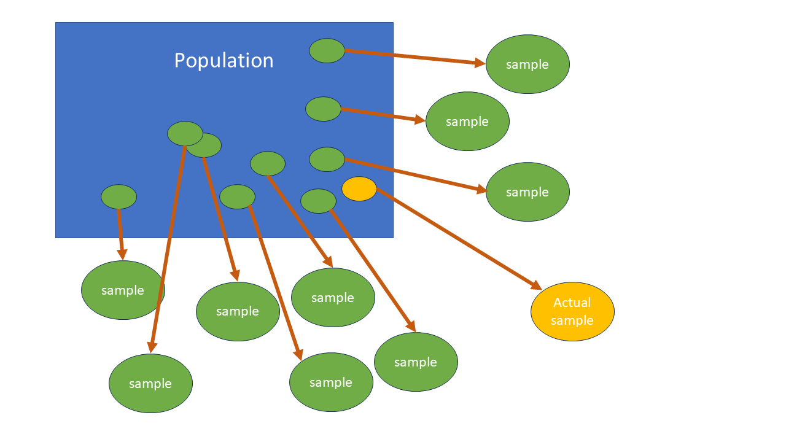
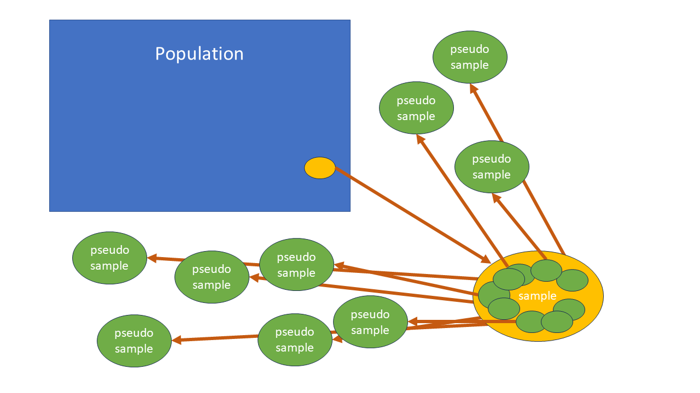

# Weight adjustments

<!--- For HTML Only --- Equivalent code for .pdf must be included in preamble.tex -->
`r if (!knitr:::is_latex_output()) '
$\\DeclareMathOperator*{\\argmin}{argmin}$
$\\newcommand{\\var}{\\mathrm{Var}}$
$\\newcommand{\\bfa}[2]{{\\rm\\bf #1}[#2]}$
$\\newcommand{\\rma}[2]{{\\rm     #1}[#2]}$
$\\newcommand{\\estm}{\\widehat}$'`

## Weight Calibration

At the end of a survey we may find ourselves in the undesirable situation that

 * **Purely by chance**, the sample is somewhat unbalanced: e.g. by chance we may have 
   selected many more males than females, or more large households than small ones, or
 * We may have had **unit nonresponse** - i.e. there may be selected units from
   which we have collected no data.  In the case of human subjects this may have
   been from a failure to contact the selected person, or the refusal of the 
   person to answer any of our questions.  (We may have also had **item nonresponse**, 
   where some items on a questionnaire weren't answered: we'll deal with that
   in the next Chapter.)
   
In both cases we are in the situation that our sample, even using its sampling weights, is
not a good representation of the population from which it is drawn.  

```{r echo=FALSE, message=FALSE, warning=FALSE}
nzpop <- read.csv("data/year-age-sex.csv")
nzpop <- nzpop |>
  filter(Year==2018)
nzpop <- nzpop[nzpop$Age>=15 & nzpop$Age<=45,]
idx <- nzpop$Age==45
nzpop$count[idx] <- (1/5)*nzpop$count[idx]
nzpop <- nzpop |>
  mutate(AgeGrp=case_when(Age<=20 ~ "15-24",
                          Age<=30 ~ "25-34",
                          Age<=45 ~ "35-45"))
nzpop <- nzpop |>
  mutate(count=round(count)) |>
  group_by(AgeGrp,Sex) |>
  summarise(count=sum(count)) |>
  as.data.frame()
nzpop <- nzpop |> rename(Gender=Sex)
nzpop$Gender <- factor(nzpop$Gender,levels=c("Male","Female"))
levels(nzpop$Gender) <- tolower(levels(nzpop$Gender))
total <- sum(nzpop$count)
total.Gender <- tapply(nzpop$count, nzpop$Gender, sum)
total.AgeGrp <- tapply(nzpop$count, nzpop$AgeGrp, sum)
total.AgeGrp <- data.frame(AgeGrp=names(total.AgeGrp),Nh=total.AgeGrp)
```

```{r echo=FALSE}
surf <- read.csv("data/surf.csv")[,1:8]
bigN <- total
n <- nrow(surf)
surf$Gender <- factor(surf$Gender, levels=c("male","female"))
surf <- surf |>
  mutate(AgeGrp=case_when(Age<=24 ~ "15-24",
                          Age<=34 ~ "25-34",
                          Age<=45 ~ "35-45"))
surf$bigN <- bigN
surf$weight <- bigN/n
n.Gender <- tapply(surf$Gender, surf$Gender, length)
sampweight <- bigN/n
```

For example consider the SURF dataset, which is a synthetic sample of 200 individuals
between the ages of 15 and 45.  The first 10 rows are shown below.  

```{r echo=FALSE}
surf |> slice_head(n=10) |>
  kbl() |>
  kable_styling(full_width=FALSE)
```

The dataset contains a mixture of numerical and categorical variables, all with very
self explanatory names (except note that `Income` and `Hours` are weekly quantities, 
and also that the income values are somewhat old!).  We'll treat it as a SRSWOR from
the New Zealand population between the ages of 15 and 45.  

The total population in this age range is $N=`r total`$, the sample size is $n=`r n`$, 
and so the weight of each sampled individual is 
\[
   w = \frac{N}{n} = \frac{`r bigN`}{`r n`} = `r sprintf("%.1f",bigN/n)`
\]
Let's specify this simple random sampling design to R:
```{r}
surf.des <- svydesign(id=~1, fpc=~bigN, data=surf)
```
and then estimate the mean income:
```{r}
svymean(~Income, design=surf.des)
```
We should note that the mean income differs considerably between males and females.
```{r}
svyby(~Income, by=~Gender, design=surf.des, svymean)
```

```{r echo=FALSE}
svyboxplot(Income~Gender, design=surf.des, main="Income by Gender", ylab="Weekly income")
```

Let's also note the distribution of the population by age and sex, as measured
by the most recent census:
```{r echo=FALSE}
nzpoptab <- nzpop |> 
  arrange(Gender) |>
  pivot_wider(names_from="Gender", values_from="count") |>
  as.data.frame()
nzpoptab$Total <- apply(nzpoptab[,-1],1,sum)
nzpoptab <- rbind(nzpoptab, 
                  data.frame(AgeGrp="Total", rbind(apply(as.matrix(nzpoptab[,-1]),2,sum))))
nzpoptab.pct <- as.data.frame(lapply(nzpoptab,
  function(x) {
    if(is.numeric(x)) return(sprintf("%.1f%%",100*x/total)) else (return(x))
  }))
nzpoptab |>
  kbl() |>
  kable_styling(full_width=FALSE)
```

Or we can express these counts as percentages:
```{r echo=FALSE}
nzpoptab.pct |>
  kbl() |>
  kable_styling(full_width=FALSE)
```

The proportions of males and females in the population are roughly equal in the population, 
but in the sample they're not quite equal:
```{r}
svymean(~Gender, design=surf.des)
```
This has been caused by our having, by chance, sampled slightly more females than males.
```{r}
table(surf$Gender)
```

The consequence of this is that our estimate of the population mean income is 
and underestimate, due to females earning less than males, and their being 
slightly overrepresented in the sample.

One obvious solution to this situation is to slightly upweight the males in the sample, and downweight
the females, to take care of the imbalance.  Of course we only **know** about the 
imbalance because we have the census counts which tell us that the proportions of
males and females are roughly equal: otherwise we'd have no idea that there might be a problem.

These external counts (external to the survey that is) are called **population benchmarks**, 
and the weight adjustment that makes the weights match the benchmarks is called
**poststratification**.  It's 'post-' here because we're making the stratification 
(breaking into groups) **after** the survey has taken place.  Breaking the sample into 
groups **beforehand**, and taking separate samples within each group is called stratified
sampling.  But that is only possible if we know the group membership of sample members before
we sample them - i.e. if the group membership information is available on the frame.  

We have $n=`r n`$ individuals in a SRSWOR drawn from a population
of size $N=`r as.character(bigN)`$, with weights 
$w=`r as.character(bigN)`/`r n`=`r sprintf("%.1f",bigN/n)`$.  These
correctly add up to the population total
\[
   n \times w = n \times \frac{N}{n} = `r n`\times `r sprintf("%.1f",bigN/n)` = `r as.character(bigN)`
\]
What we want is different weights for the males and females, so that they separately 
add up to the total numbers of males $N_1=`r as.character(total.Gender[1])`$ and the total
numbers of females $N_2=`r as.character(total.Gender[2])`$ in the population.  We can achieve this
by computing new post-stratified weights using the known benchmarks $N_h$ and sample
sizes $n_h$ in each of the post-strata, and computing new weights
\[
   w_h = \frac{N_h}{n_h}
\]
i.e. these are the weights we'd have used if we had actually carried out a
stratified sample in the first place.

```{r echo=FALSE}
pstab <- data.frame(Gender=c("male","female"),
                    SampWeight=sampweight,
                    nh=n.Gender,
                    Nh=total.Gender,
                    PostStratWeight=total.Gender/n.Gender)
rownames(pstab) <- NULL
pstab |>
  kbl() |>
  kable_styling(full_width=FALSE)
```

These new weights are now appropriately higher for males and lower for females.

```{r echo=FALSE}
Gender.benchmarks <- pstab[,c("Gender","Nh")]
```


In R we can modify the weights in the design object using the `postStratify()` function. 
We first need to create a data frame storing the benchmarks:
```{r echo=FALSE}
Gender.benchmarks |> kbl() |> kable_styling(full_width=FALSE)
```

```{r}
surf.des.ps <- postStratify(surf.des, strata=~Gender, 
                            population=Gender.benchmarks)
```

The orignal estimate of the proportions of males and females
```{r}
svymean(~Gender, design=surf.des)
```
has been modified to
```{r}
svymean(~Gender, design=surf.des.ps)
```
Notice that the Standard Errors here are zero: these proportions are no longer
estimates, they have been **imposed** by our benchmarks.

Then we can compare the orginal estimate of mean income
```{r}
svymean(~Income, surf.des)
```
with the post-stratified estimate
```{r}
svymean(~Income, surf.des.ps)
```
The estimate has been increased slightly as expected.  Also note that 
the Standard Error has been reduced: this is often the case with
post-stratified estimates: post-stratification makes the properties
of different samples differ less than they otherwise would, and thereby 
reduces our overall uncertainty.  

### Poststratification as a treatment for non-response {-}

Non-response can make the small chance differences described in the previous section even worse.

In population surveys males and young people tend to have the lowest response rates.
So let's see what happens to our mean income estimate if we take our sample of 200 individuals
and filter out 20% of the male respondents:
```{r}
set.seed(234)
surf.nonresp <- surf
surf.nonresp$Responds <- rbinom(nrow(surf),1,prob=ifelse(surf$Gender=="male",0.8,1.0))
surf.nonresp <- surf.nonresp[surf.nonresp$Responds==1,]
surf.nonresp$weight <- bigN/nrow(surf.nonresp)
table(surf.nonresp$Gender)
```

We've now got a lot fewer males than females.  Let's see what this does to the 
simple estimate of the population mean income:
```{r}
surf.nonresp.des <- svydesign(id=~1, fpc=~bigN, data=surf.nonresp)
svymean(~Income, design=surf.nonresp.des)
```

The introduction of the non-response has led to a reduction in our original estimate
from `r round(svymean(~Income, surf.des),2)` to `r round(svymean(~Income, surf.nonresp.des),2)`.

Post-stratifying however
```{r}
surf.nonresp.des.ps <- postStratify(surf.nonresp.des, strata=~Gender, 
                                    population=Gender.benchmarks)
```
leads to a dramatically improved estimate
```{r}
svymean(~Income, design=surf.nonresp.des.ps)
```

We know more than just the distribution of the population over Gender, we also know it over the
three age groups.  So we can post-stratify by these variables too.

```{r echo=FALSE}
AgeGrp.Gender.benchmarks <- nzpop
```

We can store the AgeGrp/Gender benchmarks in a data frame `AgeGrp.Gender.benchmarks`:
```{r echo=FALSE}
AgeGrp.Gender.benchmarks |> kbl() |> kable_styling(full_width=FALSE)
```
and then post-stratify
```{r}
surf.nonresp.des.ps2 <- postStratify(surf.nonresp.des, strata=~AgeGrp*Gender, 
                                     population=AgeGrp.Gender.benchmarks)
svymean(~Income, design=surf.nonresp.des.ps2)
```
And this is estimate is going to be even better than before.

However where should we stop?  Should we post-stratify by as many variables as we 
possibly can?

In general we need to ensure that we have enough individuals in the sample 
in every cross-classified cell (in this case AgeGroup by Gender) to be able to 
recalculate the weight.  Empty cells are going to cause us a problem, 
since we'll be discarding the population weight associated
with people of that type in the population who happen not to have turned up in the sample.

In population surveys run by Statistics NZ we'll often see post-stratification by age 
(in 5 year bands), sex, ethnicity (in large amalgamated groups), and large regions.  

#### The origin and nature of nonresponse {-}

Post-stratification is often used to modify weights in the presence of non-response.
The idea is that in each post-stratum the people who do respond represent well the people
who don't respond.  

This is a very big and untestable assumption.

The reasons that people do or don't respond are complicated.  The greatest risk to a
survey is that the non-respondents differ from the respondents on the characteristic 
of interest.  

For example if we're doing a survey of incomes, perhaps all the high income
people don't respond - there's no way to adjust for this, because the only way to know about
income is to have them answer the survey.  So we'll never find out about high income people,
nor find out what their incomes actually are.

Post-stratifying the income survey above by age and sex means that we're assuming that 
the respondents in each age-sex category are a simple random sample from all of the
sample members selected into the survey.  We can cope with, and adjust for, differing response rates
**between** the post-strata, but we can never adjust for different likelihoods of response
**within** the post-strata.  

A helpful approach to missing data has a typology with three types of missingness.  
If we have auxiliary data ${\bf X}_i$, known for each unit, and are interested in an outcome
variable $Y_i$ for each unit, then we are interested in the **probability that unit $i$ 
will respond if selected**
\[
   \phi_i = \Pr(\text{Unit $i$ responds} | \text{Unit $i$ is selected})
\]

1. **Missing Completely at Random (MCAR)**. This is when the probability of 
   response $\phi_i$ is the same for all units, no matter what their value of 
   $Y_i$ and ${\bf X}_i$.

   This is the best situation: the respondents and nonrespondents do not 
   differ in any important way, and it is as if the nonrespondents had been 
   selected at random from the sample. To analyse data where we have MCAR, 
   we can simply ignore the non-responding units.  
   
2. **Missing at Random (MAR)**. This is also known as 'missing at random given 
   covariates' or alternatively 'ignorable nonresponse.'  This occurs when 
   the probability of response $\phi_i$ depends **only on known quantities**: 
   the auxiliary covariates ${\bf X}_i$, but not on the unknown $Y_i$. 
   We therefore assume that if two units have the same values of ${\bf X}$, then their 
   likelihood of response is the same.

   This is a slightly more complex situation than MCAR, but we can still 
   fully account for nonresponse.  This is the approach that post-stratification
   implements: we treat all respondents as equally likely to respond within
   the post-strata.

3. **Nonignorable Nonresponse.** This is the unfortunate situation where the 
   probability of response $\phi_i$ depends on the outcome of interest $Y_i$ 
   (as well, possibly, as ${\bf X}_i$).

MAR and MCAR are **strong assumptions**. If the data are MAR we can test whether 
they are MCAR by comparing nonresponse rates in subgroups defined by ${\bf X}$ (or by 
logistic regression if any of the X variables are continuous) and test for 
any dependence on ${\bf X}$. 

However it is in general impossible to distinguish whether the data are MAR or 
whether there is nonignorable response.  

We of course exclude from consideration any data which is **missing by design.**
There are individuals who if selected turn out to be out of scope (ineligible to 
participate).  These may also be data items which are missing because the respondent 
is not asked that particular question (e.g. we do not ask for the voting 
record of children who are not entitled to vote.)

### Raking {-}

We may not have full cross-classified benchmarks, for example we might know the
totals by AgeGrp and totals by Gender, but not totals by AgeGrp and Gender simultaneously.
In that case we can proceed iteratively: we post-stratify first by one variable, and
then by other.  Each post-stratification on one variable messes up the post-stratification
on the other.  But eventually the weights will converge to approximately match both sets
of benchmarks.  This iteration is called **raking** (like raking a lawn one way, then other other), 
or **Iterative Proportional Fitting**. 

```{r echo=FALSE}
AgeGrp.benchmarks <- total.AgeGrp
```

R implements raking in with the `rake()` function. We need a separate set of benchmarks
for AgeGrp
```{r echo=FALSE}
AgeGrp.benchmarks |> kbl() |> kable_styling(full_width=FALSE)
```
and for Gender
```{r echo=FALSE}
Gender.benchmarks |> kbl() |> kable_styling(full_width=FALSE)
```

With these we can rake the design:
```{r}
surf.nonresp.des.rake <- rake(surf.nonresp.des, 
                              sample=list(~AgeGrp, ~Gender), 
                              population=list(AgeGrp.benchmarks, Gender.benchmarks))
```
and then calculate our estimates
```{r}
svymean(~Income, design=surf.nonresp.des.rake)
```

We can compare estimated population totals with the Population benchmarks:
```{r echo=FALSE}
nzpoptab |> kbl() |> kable_styling(full_width=FALSE)
```

Estimated counts with no weight adjustments
```{r echo=FALSE}
svyby(~Gender, by=~AgeGrp, FUN=svytotal, design=surf.nonresp.des) |>
  kbl(col.names=c("AgeGrp","male","female","SE(male)","SE(female)")) |> 
  kable_styling(full_width=FALSE)
```

Post-stratified by Gender
```{r echo=FALSE}
svyby(~Gender, by=~AgeGrp, FUN=svytotal, design=surf.nonresp.des.ps)  |>
  kbl(col.names=c("AgeGrp","male","female","SE(male)","SE(female)")) |> 
  kable_styling(full_width=FALSE)
```

Post-stratified by Age Group cross classified with Gender: exact match to benchmarks
```{r echo=FALSE}
svyby(~Gender, by=~AgeGrp, FUN=svytotal, design=surf.nonresp.des.ps2)  |>
  kbl(col.names=c("AgeGrp","male","female","SE(male)","SE(female)")) |> 
  kable_styling(full_width=FALSE)
```

Post-stratified by raking to Age Group and Gender marginal totals: approximate
match to benchmarks
```{r echo=FALSE}
svyby(~Gender, by=~AgeGrp, FUN=svytotal, design=surf.nonresp.des.rake)  |>
  kbl(col.names=c("AgeGrp","male","female","SE(male)","SE(female)")) |> 
  kable_styling(full_width=FALSE)
```

```{r echo=FALSE}
ff <- function(x) c(as.numeric(x), SE(x))
```

Finally compare the estimates of mean income
```{r echo=FALSE}
dd <- data.frame(Method=c("True","No adjustment","PS(Gender)","PS(AgeGrp*Gender)","Rake(Age+Gender)"),
                 rbind(c(mean(surf$Income), 0),
                       ff(svymean(~Income, design=surf.nonresp.des)),
                       ff(svymean(~Income, design=surf.nonresp.des.ps)),
                       ff(svymean(~Income, design=surf.nonresp.des.ps2)),
                       ff(svymean(~Income, design=surf.nonresp.des.rake))))
dd |>
  rename(Estimate=X1, SE=X2) |> 
  kbl() |> kable_styling(full_width=FALSE)
```
The Standard Errors are all similar, though we do get a small reduction in SE
with post-stratification.  However it is the reduction in the biasing
effect of non-response that is most striking. 

```{r message=FALSE, warning=FALSE, echo=FALSE}
#| fig.width=5,
#| fig.align="center",
#| fig.cap="Estimates of mean income by adjustment method"
par(mar=c(5.1,8.1,4.1,2.1))
sc <- cbind(dd$X1-1.96*dd$X2, dd$X1+1.96*dd$X2)
ns <- nrow(sc)
dotchart(dd$X1, xlim=range(sc), xlab="Mean Income")
arrows(sc[,1], 1:ns, sc[,2], 1:ns, angle=90, code=3, length=0.1)
axis(2, at=1:ns, lab=dd$Method, las=2, cex=0.40)
```

### Another example {-}

In the Academic Performance Indicator dataset we have full population information
on types of School (`stype`=Elementary/Middle/High) and whether or not they
met their year round performance indicators (`yr.rnd`=Yes/No).  These counts
will be our benchmarks for post-stratification.

```{r echo=FALSE}
apipopc <- apipop[!is.na(apipop$enroll),]
apipopc$stype <- factor(as.character(apipopc$stype),levels=c("E","M","H"))
levels(apipopc$stype) <- c("Elementary","Middle","High")
apipopc$yr.rnd[is.na(apipopc$yr.rnd)] <- "Yes"
```

The numbers of schools by type are in `stype.benchmarks`
```{r echo=FALSE}
stype.benchmarks <- as.data.frame(table(apipopc$stype))
names(stype.benchmarks) <- c("stype","Freq")
stype.benchmarks |> kbl() |> kable_styling(full_width=FALSE)
#sum(stype.benchmarks$Freq) # 6157
```

The number of schools by achievement of year round objectives are in `yr.rnd.benchmarks`
```{r echo=FALSE}
yr.rnd.benchmarks <- as.data.frame(table(apipopc$yr.rnd))
names(yr.rnd.benchmarks) <- c("yr.rnd","Freq")
yr.rnd.benchmarks |> kbl() |> kable_styling(full_width=FALSE)
#sum(yr.rnd.benchmarks$Freq) # 6157
```

and we also have these counts **cross-classified**, i.e. numbers of schools for 
each combination of `stype` and `yr.rnd`:
```{r echo=FALSE}
stype.yr.rnd.benchmarks <- as.data.frame(table(apipopc$stype, apipopc$yr.rnd))
names(stype.yr.rnd.benchmarks) <- c("stype","yr.rnd","Freq")
stype.yr.rnd.benchmarks |> kbl() |> kable_styling(full_width=FALSE)
```

Select a two stage cluster sample - and then make estimates of the mean school 
size (`enroll`)
```{r}
set.seed(111)
api2sc <- apipopc |> 
  select.2sc(n=40, cfraction=0.30, mmin=2, clustervar="dnum") 
api2sc.des <- svydesign(ids=~dnum+snum, fpc=~bigN1+bigN2, data=api2sc) 
table(api2sc$stype)/nrow(api2sc)
svytable(~stype, design=api2sc.des)
svytable(~stype, design=api2sc.des)/sum(api2sc$weight)
svymean(~enroll, design=api2sc.des)
svyby(~enroll, by=~stype, api2sc.des, svymean)
```

Poststratify by stype and re-estimate
```{r}
api2sc.des.ps <- postStratify(api2sc.des, strata=~stype, population=stype.benchmarks)
svymean(~enroll, api2sc.des.ps)
```

Postratify by stype by yr.rnd and reestimate
```{r}
api2sc.des.ps2 <- postStratify(api2sc.des, strata=~stype+yr.rnd, 
                               population=stype.yr.rnd.benchmarks)
svymean(~enroll, api2sc.des.ps2)
```

Poststratify by stype + yr.rnd (i.e. we only have the marginals so we need to rake) 
and reestimate
```{r}
api2sc.des.rake <- rake(api2sc.des, 
                        sample=list(~stype, ~yr.rnd), 
                        population=list(stype.benchmarks, yr.rnd.benchmarks))
svymean(~enroll, api2sc.des.rake)
```

```{r echo=FALSE}
ff <- function(x) c(as.numeric(x), SE(x))
```

Compare
```{r echo=FALSE}
ss <- rbind(
  c(mean(apipopc$enroll), 0),
  ff(svymean(~enroll, api2sc.des)), 
  ff(svymean(~enroll, api2sc.des.ps)), 
  ff(svymean(~enroll, api2sc.des.ps2)), 
  ff(svymean(~enroll, api2sc.des.rake))) 
dimnames(ss) <- list(c("Cenus","2SC","2SC+PS(stype)","2SC+PS(stype x yr.rnd)","2SC+Rake(stype+yr.rnd)"),
                     c("Estimate","SE"))
ss |> kbl() |> kable_styling(full_width=FALSE)
```

## Replicate weights

For some weight adjustments we no longer have a reliable method of computing
the standard errors of our estimates.  This can occur when we have very 
complex designs.  It can also be necessary when we don't have access to the frame, 
and therefore don't have all the information we need (such as population sizes in clusters)
to calculate standard errors.  

In such circumstances we often create multiple sets of weights in addition to the
adjusted weights.  These **replicate weights** are what are used to estimate the
standard errors, and they have the advantage that they can create standard errors
for a wider range of estimators than the usual means and totals.

The basic idea comes from recalling what standard errors are: they are the
variability we'd see in an estimate across all possible samples from the population
using the chosen sample design and sample size (Figure \@ref(fig:sampling-from-population)).

```{r sampling-from-population, echo=FALSE}
#| fig.cap="Sampling error is the variation among the estimates that would be calculated from all possible samples from the population.",
#| fig.width=5,
#| fig.align='center'

```

Once we've completed a survey we obviously can't take any more samples from the 
population.  Instead we use the variability we see within the **sample** to capture
and estimate the variability we'd see in different samples from the **population**
(Figrue \@ref(fig:pseudo-sampling)).

```{r pseudo-sampling, echo=FALSE}
#| fig.cap="In Jacknife estimation sampling error can be estimated by calculating the variability among estimates from subsets taken from the sample.  This variability needs to be scaled up to get the true population variability, because the pseudo-samples resemble one another strongly, though not exactly.",
#| fig.width=5,
#| fig.align='center'

```

Instead of actually resampling from our sample, we instead vary the weights
on some or all of the units, and create new sets of weights according to a well defined
method.  We do this multiple times, which is equivalent to taking multiple re-samples
of our actual sample.  Each re-sample is called a **replicate** and has its own set of 
weights for all of the units in the sample. e.g. we might have 100 additional sets of 
replicate weights attached to our survey data set, as well as the actual weights.  

We then use these replicate weights to calculate a set of alternative
values for our estimate of interest.  The variability among these replicate 
estimates is then used to determine the standard error.  

There are a number of different ways to create replicate weights: we'll consider just one
known as the **Jackknife**.

Each Jacknife replicate set of weights is calculated by deleting one or more PSUs at 
the first stage of selection by setting their weights to zero.  We then rescale the 
weights  of the remaining units so that they still add up to the same total weight (i.e so 
they weights still add up to the population size).  Table \@ref(tab:examplejk) shows an example.

```{r echo=FALSE}
exdat <- data.frame(id=1:12, psu=rep(LETTERS[1:4],c(3,4,2,3)),
                    weight=rep(c(100,80,120,100),c(3,4,2,3)))
ss <- sum(exdat$weight)
exdat$rep01 <- rep(c(0,1,1,1),c(3,4,2,3))
exdat$rep02 <- rep(c(1,0,1,1),c(3,4,2,3))
exdat$rep03 <- rep(c(1,1,0,1),c(3,4,2,3))
exdat$rep04 <- rep(c(1,1,1,0),c(3,4,2,3))
exdat$rep01 <- exdat$rep01*exdat$weight*ss/sum(exdat$rep01*exdat$weight)
exdat$rep02 <- exdat$rep02*exdat$weight*ss/sum(exdat$rep02*exdat$weight)
exdat$rep03 <- exdat$rep03*exdat$weight*ss/sum(exdat$rep03*exdat$weight)
exdat$rep04 <- exdat$rep04*exdat$weight*ss/sum(exdat$rep04*exdat$weight)
exdat$col01 <- ifelse(exdat$rep01==0, "#FDD","")
exdat$col02 <- ifelse(exdat$rep02==0, "#FDD","")
exdat$col03 <- ifelse(exdat$rep03==0, "#FDD","")
exdat$col04 <- ifelse(exdat$rep04==0, "#FDD","")
```


```{r examplejk, echo=FALSE}
#exdat$rep01 <- cell_spec(exdat$rep01, color = ifelse(exdat$rep01==0, "light blue", ""))
exdat <- rbind(exdat,
               data.frame(id="Total",
                          psu="",
                          weight=sum(exdat$weight),
                          rep01=sum(exdat$rep01),
                          rep02=sum(exdat$rep01),
                          rep03=sum(exdat$rep01),
                          rep04=sum(exdat$rep01),
                          col01="",col02="",col03="",col04=""
                          ))
tab.caption <- "Example of Jacknife replicate weights: a sample of 4 clusters (PSUs) with sets of replicate weights, each one deleting the weight of a single PSU, and rescaling to maintain the total of the weights."
if(knitr::is_latex_output()) {
  exdat |> 
    select(id:rep04) |>
    mutate(across(rep01:rep04, \(x) round(x, digits=1))) |> 
    kbl(caption=tab.caption, escape=FALSE) |> 
    kable_styling(full_width=FALSE) 
} else {
  exdat |> 
    select(id:rep04) |>
    mutate(across(rep01:rep04, \(x) round(x, digits=1))) |> 
    kbl(caption=tab.caption, escape=FALSE) |> 
    kable_styling(full_width=FALSE) |>
    column_spec(3+0, background="#DDF") |>
    column_spec(3+1, background=exdat$col01) |>
    column_spec(3+2, background=exdat$col02) |>
    column_spec(3+3, background=exdat$col03) |>
    column_spec(3+4, background=exdat$col04) 
}
```

We can create a set of replicate weights for the two stage cluster sample from the API
data set as follows:
```{r}
api2sc.jkdes <- as.svrepdesign(api2sc.des, type="JK1")
```
There is an informative warning here: no fpc can apply at second stage of selection 
(nor any subsequent stages).  

The specification **JK1** here indicates that the design is not stratified.

Here are the first 5 rows and 8 columns of replicate weights: each row refers to a PSU 
(i.e. a district `dnum`) and each column is a replicate.
```{r}
api2sc.jkdes$repweights$weights[1:5,1:8]
```
Replicate Weights are $n/(n-1)=40/39=1.025641$ - drops one of the 40 selected districts 
`dnum` out for each replicate, setting the weight for all units selected in that district to zero.

These are called **scaling weights**, and they need to be multiplied by the 
original sampling weight to get the actual replicate weights.

We can use this design just as in earlier examples to get estimates and standard errors:  
```{r}
svymean(~enroll, design=api2sc.jkdes)
```
This gives us a good estimate of the SE, similar to what we get from the original
sample design specification:

```{r}
svymean(~enroll, design=api2sc.des)
```
Note that the estimate itself is identical: in both cases they come from the same single set
of sample weights.

If we are needing to post-stratify our weights to account for non-response, then
we need also to poststratify each set of replicate weights.

```{r}
api2sc.jkdes.ps <- postStratify(api2sc.jkdes, strata=~stype, population=stype.benchmarks)
svymean(~enroll, design=api2sc.jkdes.ps)
```
Here post-stratification gives us a strong reduction of the standard errors, as we saw 
earlier.

Here's a comparison of the various estimates and standard errors from the 
various methods we've seen so far:
```{r echo=FALSE}
ss <- rbind(
  c(mean(apipopc$enroll), 0),
  ff(svymean(~enroll, api2sc.des)), 
  ff(svymean(~enroll, api2sc.des.ps)), 
  ff(svymean(~enroll, api2sc.des.ps2)), 
  ff(svymean(~enroll, api2sc.des.rake)),
  ff(svymean(~enroll, api2sc.jkdes)),
  ff(svymean(~enroll, api2sc.jkdes.ps))
  ) 
dimnames(ss) <- list(c("Cenus","2SC","2SC+PS(stype)","2SC+PS(stype x yr.rnd)","2SC+Rake(stype+yr.rnd)",
                       "JK1","JK1+PS(stype)"),
                     c("Estimate","SE"))
ss |> kbl() |> kable_styling(full_width=FALSE)
```
Important points to note:

* the SE is reduced by post-stratification, and
* we get similar SEs when we use the jacknife estimation method.

Let's take a look at the replicate weights after post-stratification
```{r}
api2sc.jkdes.ps$repweights$weights[1:5,1:8]
```
They're no longer the same in the different PSUs.

**This seems to be a lot of additional work:** we get the same SEs and estimates
using the standard formula-based estimation methods for SEs.  Why bother
with replicate weights in that case?

There are three reasons:

* For some very **complex designs** there are no formula based estimation methods
  that can be used;
* For some **estimates**, such as medians and quartiles, replicate methods are
  more reliable than formula based methods;
* Replicate based methods are robust in the presence of small samples and outliers, 
  and can also be used to estimate bias (as well as standard errors).

It's commonly the case that rather than calculating them for ourselves we might 
inestead have been **supplied** replicate weights, i.e. someone else might have
created them.  This often happens when we have been granted access
to a data set collected by a government department or agency concerned about
confidentiality, and in those instances we are not given access to the frame. 

In which case the weights in the first 10 rows of our API two stage cluster dataset would look like this
```{r echo=FALSE}
fwmat <- api2sc.jkdes.ps$repweights$weights[api2sc.jkdes.ps$repweights$index,]
colnames(fwmat) <- paste0("repweight",sprintf("%0.3d",1:ncol(fwmat)))
pweight <- api2sc.jkdes.ps$pweights
fwmat <- diag(pweight)%*%fwmat
api2sc.withrep.ps <- cbind(api2sc, pweight, fwmat)
row.names(api2sc.withrep.ps) <- NULL
api2sc.withrep.ps[1:10 ,c(1,47,48:55),] |> kbl() |> kable_styling(full_width=FALSE)
```
Unlike the example earlier, these replicate weights are **combined weights** - 
i.e. they do not need to be multiplied by the original weight, and they
each separately add up to the same value: the population size.  

We use a data set like this to specify the sample design to R using just 
the probability weights `pweight`and the set of replicate weights `repweight001-repweight040`.
We don't specify the cluster variables when specifying the design.  
```{r}
pweightcol <- match("pweight",names(api2sc.withrep.ps)) # which column name is exactly equal to pweight
repweightcols <- grep("^repweight",names(api2sc.withrep.ps)) # which columnnames start with repweight?
varcols <- (1:ncol(api2sc.withrep.ps))
varcols <- varcols[!(varcols%in%c(pweightcol,repweightcols))]
n <- length(unique(api2sc$dnum))
api2sc.repdes.ps <- svrepdesign(variables=api2sc.withrep.ps[,varcols],
                                weights=api2sc.withrep.ps[,pweightcol],
                                repweights=api2sc.withrep.ps[,repweightcols],
                                combined.weights=TRUE,
                                scale=(n-1)/n,
                                type="JK1")
svymean(~enroll, api2sc.repdes.ps)
```
```{r echo=FALSE}
ss <- rbind(
  c(mean(apipopc$enroll), 0),
  ff(svymean(~enroll, api2sc.des)), 
  ff(svymean(~enroll, api2sc.des.ps)), 
  ff(svymean(~enroll, api2sc.des.ps2)), 
  ff(svymean(~enroll, api2sc.des.rake)),
  ff(svymean(~enroll, api2sc.jkdes)),
  ff(svymean(~enroll, api2sc.jkdes.ps)),
  ff(svymean(~enroll, api2sc.repdes.ps))
  ) 
dimnames(ss) <- list(c("Cenus","2SC","2SC+PS(stype)","2SC+PS(stype x yr.rnd)","2SC+Rake(stype+yr.rnd)",
                       "JK1","JK1+PS(stype)","JK1+PS(stype); weights only"),
                     c("Estimate","SE"))
ss |> kbl() |> kable_styling(full_width=FALSE)
```
The consequence of only being given the weights (rather than the full clustering
information) means that the first stage design is treated as PPSWR rather than SRSWOR, 
and there is no adjustment for the fpc.  That means the SEs are slightly larger. 

The method "JK1" is used for unstratified designs.  For stratified
designs the jackknife is specified by "JKn": we don't just drop out one PSU over 
the whole sample in each replicate, instead we drop out a PSU from every stratum
simultaneously.

E.g. draw a two stage cluster sample within two strata: schools which are or are
not eligible for an awards programme:
```{r}
set.seed(999)
apist2sc <- apipopc |>
  select.st2sc(n=40, stratumvar="awards", cfraction=0.20, clustervar="dnum")
apist2sc.des <- svydesign(id=~dnum+snum, strata=~awards, fpc=~bigN1+bigN2, 
                          data=apist2sc, nest=TRUE)
apist2sc.des.ps <- postStratify(apist2sc.des, strata=~stype, population=stype.benchmarks)
```
Note: we need `nest=TRUE` here because districts `dnum` do not nest within strata.
I.e. it is the **combination** of `awards` and `dnum` that actually defines the clusters here.

```{r}
svymean(~enroll, design=apist2sc.des)
svymean(~enroll, design=apist2sc.des.ps)
apist2sc.jkdes <- as.svrepdesign(apist2sc.des, type="JKn")
svymean(~enroll, design=apist2sc.jkdes)
apist2sc.jkdes.ps <- postStratify(apist2sc.jkdes, strata=~stype, population=stype.benchmarks)
svymean(~enroll, design=apist2sc.jkdes.ps)
```

There are alternative methods to Jacknife generation of replicate weights.
You may hear of Bootstrap weights, and Balanced Repeated Replication.  Some
of these have multiple variants, and there are settings in which one outperforms
the others.  Jackknife variance estimation is the most common however.  

